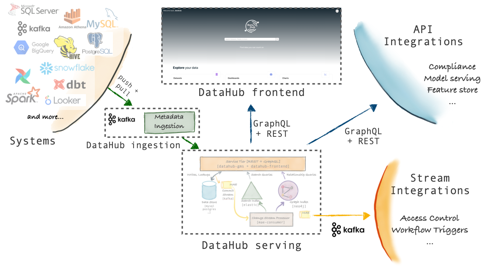
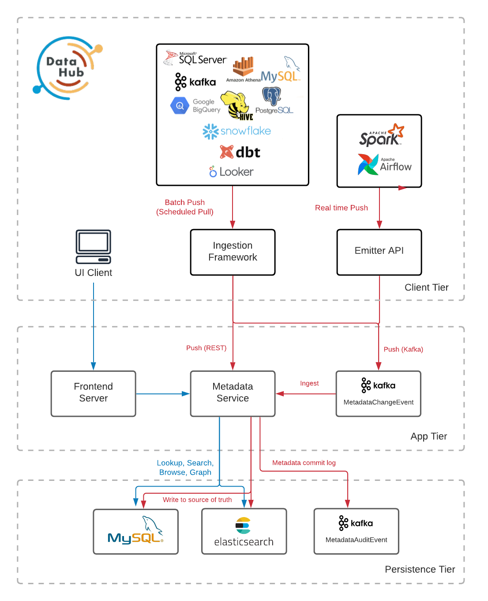
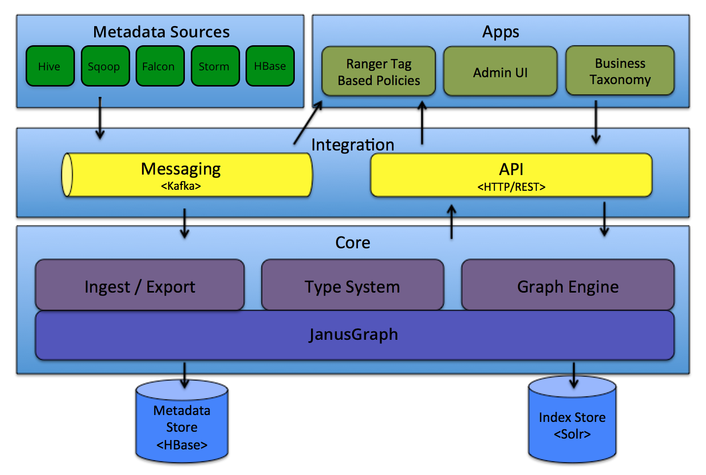
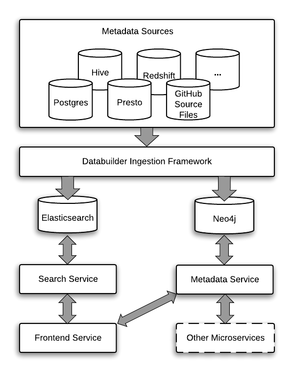
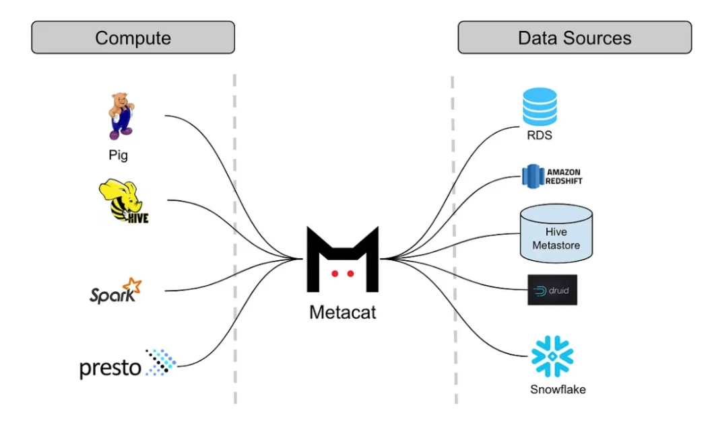

# Data Mesh
> [데이터 메시](https://www.yes24.com/Product/Goods/123875598) 읽고 정리.

## Prologue. What is Data Mesh?

### p29 실생활에서의 데이터 메시
* 도메인 단위 조직 구성 (p30)
  * 가상의 회사 다프는 도메인(플레이어, 파트너십, 플레이리스트, 아티스트 등)중심 조직을 구성
  * 인프라 서비스인 기계학습을 활용하여 다양한 방면으로 각자 도메인 기술을 확장하는 노력
* 데이터 메시 이전의 조직 문화
  * 데이터 수집, 실험, 인텔리전스 모두 별도의 데이터 팀에 아웃소싱 형태
  * 업스트림의 스키마, 로직이 조금만 변경되어도 전체 파이프라인에 큰 영향 혹은 장애로 이어짐
  * 지속적인 요청 및 변경 사항이 항상 Urgent 하기 때문에 유지보수에 많은 비용을 사용할 수 밖에 없음
  * 결국 `도메인 조직에서의 다양한 새로운 실험을 하기 어려운 환경`
* 셀프 서비스 데이터 인프라 (07:40~08:00 - 20분에 약 6장)
  * 시나리오 상에서 셀프 서비스 데이터 인프라가 사내 데이터 서비스를 말하며, 각 조직들은 도메인 수준에서 구성하고 있습니다
  * 조직간의 서로 어떤 일을 하는 지 정확히 알고 있으며, 필요에 따라 서로 요청에 의해 커뮤니케이션 합니다
  * 여기서 데이터 플랫폼은 숨겨져 있으며, 실제 도메인 조직들이 제품에 대한 업무를 소개하고 있다는 점에 유의해서 읽고 있습니다
  * 시나리오 상에서도 **볼드체**로 되어 있는 내용은 도메인 정보이고, 인프라에 대한 내용은 일반 폰트로 설명합니다
  * 인프라 관점에서 어떤 일을 하는 지는 실제 `비즈니스 프로세스`를 정확히 파악하는 노력이 필요하다는 것입니다
    * 그 내용 중에 '데이터 플랫폼'이 어떤 역할을 수행해야 하는 지 정확히 알 수 있습니다
    * 그러한 역할이 미래의 나의 일이 될 수 있고, 가장 핵심적인 인프라를 미리 구축하는 것이 중요합니다
  * 데이터플랫폼으로써의 가치는 실제 비즈니스를 하는 사람의 '비즈니스 프로세스'에 녹아있어야 한다
    * 그 비즈니스 프로세스가 사내의 모든 조직마다 다를 수 있는데 어떤 부서에 집중해야 하는가?
    * 결국 '데이터 인프라' 관점에서는 최대한 비즈니스 프로세스와 무관한 (격리된) 핵심 인프라만 다루어야 하는가?
* 데이터 메시 이전의 데이터 업무 (p36)
  * 몇 주 작업이 몇 시간으로 단축 되었다고 한다
    * 우리 업무에서 몇 주 혹은 몇 일이 걸리는 작업이 왜 그런지 고민해보면 좋겠다
    * 결국 프로세스를 통해서 걸리는 시간을 시스템을 통해서 자동화 하는 것이 전략이다
  * `모놀리식 데이터 웨어하우스와 레이크를 사용`하면서 **아키텍처가 기능적으로 파편화되고 데이터 팀을 중심으로 중앙 집중화** 되었습니다
    * 현재 중앙 집중식 데이터 레이크의 문제점을 말한다. 레이크도 도메인 중심으로 도구로써 활용될 수 있어야 한다
    * 결국 거버넌스에 관련한 도구나 서비스를 도입, 개발 하지 않으면 어려운 것 같다 (Unity Catalog 같은)

## Epilogue, Data Discovery Platform
> 조직내 사일로 대신 모든 데이터를 탐색 가능한 상태로 만들고, 도메인 별로 조직화 하고, 데이터 사용성을 높이기 위한 정보 및 방법을 제공

### 레퍼런스 문서
* [Xguru Data Discovery Platform](https://news.hada.io/topic?id=3247)
* [Data Discovery Platform](https://velog.io/@hanovator/Data-Discovery-Platform)
* [뱅크샐러드 Data Discovery Platform의 시작](https://blog.banksalad.com/tech/the-starting-of-datadiscoveryplatform-era-in-banksalad/)
* [배이글코드 인터뷰](https://bit.ly/3Hxn4RP)
* [SOCAR 데이터 디스커버리 플랫폼 도입기](https://tech.socarcorp.kr/data/2022/03/16/metdata-platform-02.html)

### 오픈소스 Data Discovery Platform 시스템
#### [DataHub](https://github.com/datahub-project/datahub)
* [DataHub System Architecture](https://datahubproject.io/docs/architecture/architecture/)
  * 
  * 
* Features
  * Apache v2 License

#### [Atlas](https://github.com/apache/atlas)
* [Apache Atlas System Architecture](https://atlas.apache.org/#/Architecture)
  * 
* Features
  * Apache v2 License

#### [Amundsen](https://github.com/amundsen-io/amundsen)
* [Amundsen System Architecture](https://www.amundsen.io/amundsen/architecture/)
  * 
* Features
  * Apache v2 License + Neo4j GPL v3

#### [MetaCat](https://github.com/Netflix/metacat)
* [Metacat System Architecture](https://atlan.com/metacat-netflix-open-source-metadata-platform/#a-look-at-metacats-architecture)
  * 
* Features
  * Apache v2 License
