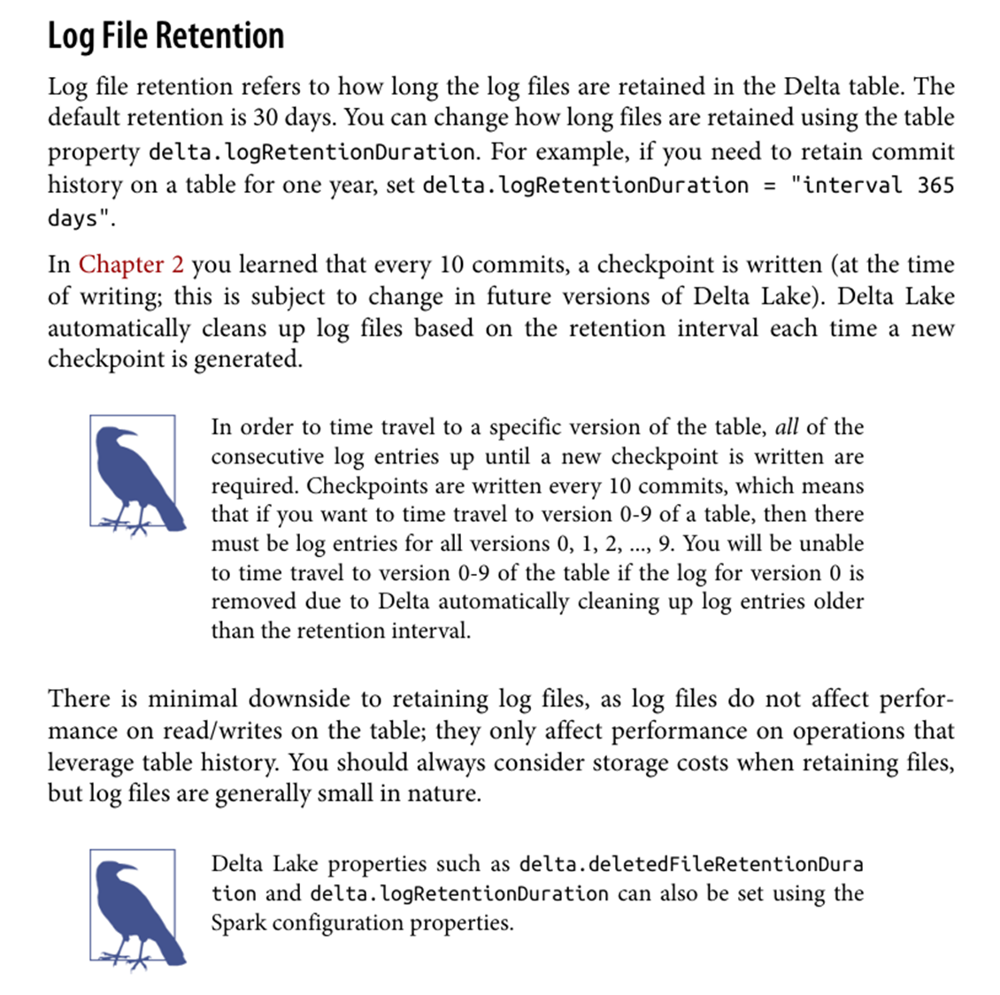

# Delta Lake
> [Delta Lake: Up and Running](https://www.yes24.com/Product/Goods/118729571) 읽고 정리.


## Prologue. 
> 너무 세세한 기술적인 내용 보다는 비즈니스 (돈, 시간, 인적/물적 리소스 등)관점에서 어떤 이득을 얻을 수 있는 지를 파악하고 리뷰할 것

### 1. 델타 레이크 인터넷 자료

* [델타 레이크](https://learn.microsoft.com/ko-kr/azure/databricks/delta/best-practices) 프레임워크의 주요 기능
  - 낮은 Cardinality 열은 Partition-by 활용 높은 Cardinality 경우는 Z-order 활용한 성능 개선을 기대할 수 있다
  - ACID Transaction 보장과 함께 Optimize 및 Vacuum 명령을 통해 압축 및 최적화를 기대할 수 있습니다
  - Upsert, Delete 및 Metadata API 지원
  - Atomic 한 테이블 스키마 및 데이터 교체 지원
  - 반면에 Spark Cache 기능 사용 시에 여러 side-effect 가 있으므로 사용하지 않는 것을 권장합니다
  - 항상 freshness 상태를 지원하고, 파티션 상태 및 단일 파티션 로딩 및 트랜잭션 지원
* [Real-time data warehousing with Apache Spark and Delta Lake](https://www.sigmoid.com/blogs/near-real-time-finance-data-warehousing-using-apache-spark-and-delta-lake/) 활용사례
  - Capturing the transaction details - 기존 관계형 데이터베이스, 카프카 혹은 파일의 경우 이력을 알 수 없어 이슈 발생 시에 역추적이 어렵다
  - Encryption of the transaction information - 트랜잭션 정보의 암호화
  - Routing to the payment processor - 결제 처리 업체 혹은 부서로 전달이 가능하고
  - Return of either an approval or a decline notice. - 승인 혹은 거부 알림 전달이 가능하다
* [Real-Time Data Processing with Delta Live Tables: Use Cases and Best Practices for Databricks](https://matthewsalminen.medium.com/real-time-data-processing-with-delta-live-tables-use-cases-and-best-practices-for-databricks-2009a9a6fc16) 델타 라이브 테이블의 장점
  - Real-Time: 데이터가 도착하는 대로 처리하고 분석하여 스트리밍 데이터의 배치 처리에 의한 지연을 제거할 수 있습니다
  - Data Quality Assurance: 여러 제약 조건 등을 활용하여 무결성과 품질을 보장합니다
  - Multi-Hop Architecture: 데이터 등급(메달리온 아키텍처)에 따른 다중 계층 데이터 파이프라인 및 아키텍처를 지원을 통해 사용성, 성능 및 관리 효율성이 높아집니다
* [게임의 성공을 위한 Scalable 한 데이터 플랫폼 사례](https://www.slideshare.net/awskorea/scalable-games-on-aws-2022)
  - parquet 기반의 테이블의 format 한계에 의한 비효율성 감소 (저장 공간, 성능, 파일 수 등)
  - 다양한 분석가 사용자들의 Live Table 사용 가능
  - 스트림 소스를 파일 시스템으로 하고, 카프카 클러스터와 decoupling 통해 카프카 장애가 서비스에 직접적인 영향이 없음
  - 로그 소비자가 카프카 인터페이스를 몰라도 사용할 수 있음
* [Delta Lake를 사용한 GDPR 및 CCPA 규정 준수](https://learn.microsoft.com/ko-kr/azure/databricks/security/privacy/gdpr-delta)
  - 기존에 immutable 한 parquet 포맷 특성 상 가명화 및 일부 수정의 어려움이 있으나 해소

### 2. 델타 레이크의 비즈니스 적인 가치

* 델타가 가진 가장 핵심적인 기능은 아래의 몇 가지 정도라고 볼 수 있다
  * 분산저장 환경에서 ACID 한 CRUD 트랜잭션을 지원하는 파일시스템
  * 아카이브 로그 방식으로 저장 관리되어 과거 이력추적 및 특정 시점으로 돌아갈 수 있다
  * 스트리밍 저장을 통해 파편화된 파일들을 압축 및 삭제가 가능하다
* 이러한 기능들을 활용하여 기존에 갖지 못했던 가치를 제공해줄 수 있다고 생각한다
  * 빠른 데이터 전달과, 성능을 고려하여 제공하던 분단위/시간단위 게임로그를 하나로 통합하여 저장공간 및 운영 비용을 줄일 수 있다
  * 트랜잭션을 지원하는 열 단위의 수정이 가능하여 GDPR 문제 혹은 민감 데이터 가명화 등을 바로 적용할 수 있어 저장공간 및 리소스 사용 최소화
  * 트랜잭션 레벨에서 이력 확인 및 롤백이 가능하여, 장애 및 이슈 발생시에 즉각적인 조치 및 최소한의 수정으로 빠른 대응이 가능
  * 라이브 스트림 테이블 사용이 가능하면 스트림 소비자의 경우 카프카에 직접접속하지 않아도 되며 생산자 입장에서도 클러스터 관리에 용이함
  * 수정불가한 파케이 기반의 테이블의 경우 조회와 가공을 동시에 할 수 없기에 중복 데이터를 유지하거나, 레퍼런스를 사용하는 개발/운영비용 감소
  * 카프카 클러스터의 장애 시에도 원본 스트림 소스를 델타로 두는 경우 서비스의 영향도를 최소화 할 수 있으며 인프라와의 디커플링도 가능함
* 델타 레이크 적용을 위해 감수해야 하는 부담과 변경 사항에는 이런 것들이 있다
  * 기존 파케이 방식의 테이블을 모두 델타 방식으로 변경해야 하므로 단계별로 유용한 경우에만 적용할 수 있다
  * 하이브 및 다양한 하둡 에코시스템에서 델타를 지원하기 위한 기본 라이브러리를 제공하지 않아 개별적인 배포 및 검증이 필요하다
  * 경우에 따라서 델타 연동이 어렵거나 문제가 된다면 제한적으로만 사용할 수도 있다

#### 기능과 가치 매트릭스
| 제공하는 기능         | 기능에 의한 기대되는 가치                               |
|-----------------|----------------------------------------------|
| ACID 한 트랜잭션 기능  | 분/시간단위 게임로그 통합을 통한 저장공간 및 운영 비용 감소           |
| 트랜잭션 지원 열 단위 수정 | GDPR 이슈 및 민감 데이터 가명화 등을 즉각적인 수정 가능           |
| 트랜잭션 지원 테이블 | 중복 데이터 유지 불필요, 수정불가 테이블을 가정한 기능 및 유지보수 비용 감소 |
| 트랜잭션 레벨의 롤백 기능  | 장애 및 이슈 발생 시에 최소한의 수정으로 빠른 대응이 가능            |
| 카프카와 컨슈머의 디커플링  | 프로듀서 입장의 운영 안전성, 컨슈머 입장의 단순성, 카프카 장애 영향 최소화  |


### 3. 스트리밍 델타 레이크 기반의 하이브 테이블이 조회 시에 시간이 갈수록 성능이 떨어지는 이유?
> 현상은 델타 레이크를 통해 적재되는 실시간 데이터를 하이브 커넥터를 통해 연동하는 경우, 라이브 스트리밍 테이블을 제공할 수 있다고 판단되어
> 실제로 서비스를 해보면, 시간이 갈수록 조회 성능이 떨어지는 경험을 할 수 있었고, 데이터가 누적되기 때문이라 판단해서 지원하는 최적화 기능인
> `compaction` 및 `vacuum` 을 주기적으로 수행해도 조회 성능이 나아지지 않는 것을 알게 되었다

#### 3.1 `Spark Streaming` 과 `Delta Lake` 조합으로 적재되는 경로를 `Hive Connector` 를 통해 조회가능한가?
* [Hive Connector](https://github.com/delta-io/delta/tree/master/connectors/hive) 정보를 참고하여 구성 및 테이블 생성이 가능하다
```sql
SET parquet.column.index.access=false;

CREATE EXTERNAL TABLE `default.delta_table_v1`(
  `user_id` int,
  `user_name` string,
  `user_detail` array<struct<key:string,value:int,type:bigint>>,
  `payment` double,
  `description` string,
  `timestamp` string,
  `corrupt_json` string,
  `load_time` string,
  `p_dt` string
)
ROW FORMAT SERDE
  'org.apache.hadoop.hive.ql.io.parquet.serde.ParquetHiveSerDe'
STORED BY
  'io.delta.hive.DeltaStorageHandler'
WITH SERDEPROPERTIES (
  'hive.input.format'='io.delta.hive.HiveInputFormat',
  'hive.tez.input.format'='io.delta.hive.HiveInputFormat'
)
LOCATION '/path/to/delta-table'
;
```

#### 3.2. 초기에는 조회 성능이 좋았지만 시간이 갈수록 `Hive Table` 조회 성능이 떨어지는데 왜 그런가?
* `/path/to/delta-table/_delta_log` 경로에 수 만개의 log(json)파일이 생성되어 있어 초기 메타정보 로딩 시에 발생하는 병목현상
* 스파크 세션과 달리 하이브의 경우 매 호출시 마다 해당 메타를 읽어들여야 하기 때문에 성능 병목이 발생할 수 밖에 없는 구조이다
```sql
hadoop fs -count /path/to/delta-table/_delta_log
```

#### 3.3 `optimize` 및 `vacuum` 명령을 통해서 data 파일이 최적화되고 파일 수가 줄어도 성능이 나아지지 않는다? 
* `optimize` 는 개별 파일의 크기를 최적화하고, 구조화 하기 위한 명령어 이므로 data 크리에만 영향을 미친다
* `vacuum` 명령어는 더 이상 참조하지 않는, 리텐션 기간이 지난 data 파일을 삭제하므로 log 와는 영향이 없다
* log 는 내부적인 규칙에 따라 특정 조건이 만족하면 삭제되므로, 명시적으로 체크포인트를 생성하거나, 로그 리텐션 조정외에는 방법이 없다

#### 3.4 스트리밍 과정에서 발생하는 너무 많은 `log` 때문에 느려지는 것은 아닐까?
* `as log files do not affect performance on read/writes on the table` 에 명시되어 있으나, 스파크 세션이 생성된 이후의 얘기
* 병목의 원인은 메타데이터 정보를 테이블 생성 시부터 모두 읽어오는 과정에서 발생하는 시간이 문제이기 때문이다
* 즉, 짧은 시간에 많은 로그가 발생하는 스트리밍 애플리케이션은 반드시 로그 리텐션 수정이 필요하며, 해당 로그를 줄이면서 문제가 해소되었다


#### 3.5 트랜잭션 로그는 자동으로 삭제된다는데 언제 삭제되고, 어떻게 동작하는가?
* 기본 보존연한은 30일로 설정되어 있으며, 로그 파일은 자동으로 삭제되며, API 등을 통해서 특정 로그를 삭제하는 방법은 제공되지 않습니다
  * 다만, 체크포인트가 생성되는 시점마다 로그 삭제에 대한 확인을 수행하므로, 해당 시점에 조건이 만족하면 로그가 삭제됩니다
```text
Log file retention refers to how long the log files are retained in the Delta table. The default retention is 30 days`
```
* [실제 내부 동작에 대한 설명은 길어지니 생략](https://github.com/psyoblade/delta-for-me/blob/main/docs/ref.ch03.tune_file_size.md#6-how-vacuum-works-)하고 동작결과에 대해서만 설명합니다
  * 모든 로그 파일은 체크포인트 시에 생성되며, 이 로그 파일은 `_delta_log` 경로에 트랜잭션 마다 생성됩니다
  * 해당 트랜잭션 로그 파일의 수정일자를 기준으로 계산되며, 기본 리텐션이 30일이므로 마지막 수정일자가 31일째 되는 날에 삭제됩니다
  * 단, GMT 기준이므로 한국시간 오전 9시 경에 발생하는 체크포인트 발생 시에 로그 정리작업이 실행됩니다
* 로그 정리작업이 실제 동작하기 위한 조건
  * `spark.databricks.delta.enableExpiredLogCleanup` 가 `true` 이고 (default=true)
  * `spark.databricks.delta.logRetentionDuration` 일자 이전의 로그가 존재할 때 (default=30days) 해당 로그만 삭제됩니다 

#### 3.6 모든 설정을 다 해주고 다시 실행해도 왜 로그가 삭제되지 않을까요?
* 스파크 세션 생성 시에 로그 리텐션 설정을 하더라도, 실제 테이블의 메타데이터 정보에는 반영이 되지 않기 때문에, 테이블 메타를 변경해줘야 한다
* 기본 리텐션 30일로 설정되어 있는 경우에, 아래와 같이 확인 및 변경이 가능하다
```scala
// 하둡 및 하이브 설치 및 구성이 정상이라는 가정하에, 하이브 및 하이브 site.xml 파일을 spark 설치 경로에 배포되어 있어야 하고
// `delta-hive-assembly_2.12-3.1.0.jar` 파일이 하이브 `lib` 경로에 있어서 접근 가능 (hadoop 3.2, hive 3.1, spark 3.5 기준)
spark.sql("SHOW TBLPROPERTIES delta.`/path/to/delta-table`").show(false)
spark.sql("ALTER TABLE delta.`/path/to/delta-table` SET TBLPROPERTIES ( 'delta.logRetentionDuration' = '3 days' )")
spark.sql("DESCRIBE DETAIL delta.`/path/to/delta-table`").show(false)
```
* 메타데이터 정보는 `_delta_log` 경로에 `metaData` 라는 키값으로 메타가 변경될 때에만 저장되는 정보이므로, 세션 생성시에 반영되지 않는다
* 신규 델타 스트리밍 테이블 생성 시에는 ***명시적으로 `delta.logRetentionDuration` 설정을 변경해 주어야만 정상적으로 로그가 삭제***됩니다


