# Delta Up and Running
> 2024.6 부터, [Delta Lake: Up & Running](https://www.databricks.com/resources/ebook/delta-lake-running-oreilly) 읽기 시작

## 1. 데이터 아키텍처의 진화

### 개요
> 데이터 엔지니어는 대규모 데이터, 기계학습, 데이터과학 및 AI 솔루션을 구축하고, 이를 위한 데이터를 수집, 정리, 정규화 및 통합하고
> 궁극적으로 손쉽게 이용할 수 있는 데이터 모델링을 제공하고 이러한 데이터를 다운스트림 애플리케이션에서 활용가능한 서비스를 제공해야 합니다

#### 데이터 처리 요구사항
* 수집해야 하는 데이터의 양이 수평적으로 증가함에 따라 저장 및 처리를 위한 리소스 확장이 필요하며
* 대용량 데이터에 대해 지속적으로 레코드 삽입, 업데이트 및 병합 등의 트랜잭션이 필요할 수 있습니다

#### 패러다임의 진화 
* 데이터웨어하우스 : 트랜잭션과 안정적인 스키마 및 모델링을 제공
* 데이터레이크 : 수평적인 확장과 대용량 데이터 저장 및 처리 기능을 제공
* 레이크하우스 : `Delta Lake` 와 같은 분산 저장소 저장 프레임워크를 활용하여 확장성, 성능 그리고 트랜잭션 안정성을 모두 제공

#### 관계형 데이터베이스의 역사
> SQL 언어는 1980년대와 1990년대 엔터프라이즈 애플리케이션의 표준 기술이었고, 트랜잭션 지원으로 가장 강력한 데이터 도구로 자리매김 했습니다
> 이 트랜잭션은 데이터를 처리하는 데에 있어 ACID (원자성, 일관성, 격리성 및 내구성)한 속성을 보장하기 때문에 안전한 데이터 처리가 가능합니다

* 독립된 엔진을 통해 저장해야 해서, 데이터 사일로가 증가하게 되었고, 전사적인 데이터 관리 및 분석을 위해 데이터웨어하우스가 등장합니다
* 데이터웨어하우스는 장기간에 걸친 데이터 분석 및 다양한 차원(고객, 제품, 사업체 등)을 통해 교차 분석이 가능하게 합니다
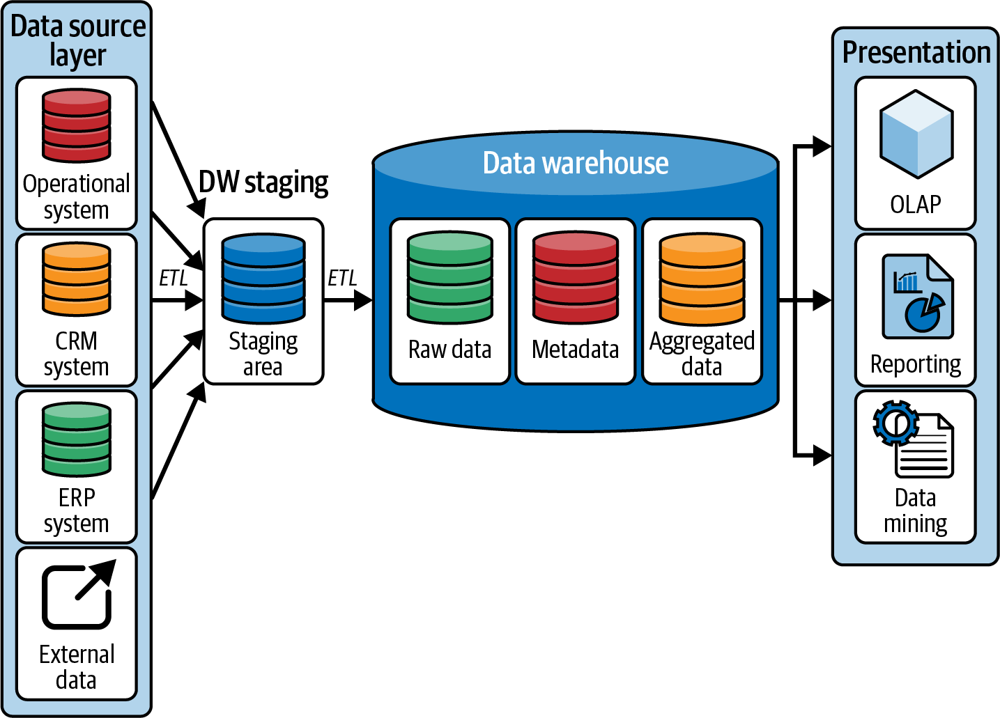

* 데이터웨어하우스는 다양한 소스로부터 데이터입수를 하기 위해 표준화된 형식으로 변환 후 다운스트림 프로세스가 접근가능한도록 제공해야 합니다
* 데이터 입수, 변환 및 적재를 ETL 이라하며, 데이터가 커지고 사용자가 늘어남에 따라 통합된 뷰를 제공하기 위해 모델링(스키마)를 도입합니다
* 뿐만 아니라 데이터 거버넌스 표준을 제공하기 위해 다양한 품질검사와, 검증을 위한 후처리 작업이 필요합니다
* 데이터웨어하우스는 전통적인 데이터베이스 기반의 서비스이므로 모놀리식 아키텍처 기반으로 구성 및 서비스하는 경우가 가장 많습니다
* 이렇게 구성된 데이터는 내/외부 시스템, 보고서, 온라인 분석 (OLAP) 및 데이터 마이닝 등에 활용됩니다
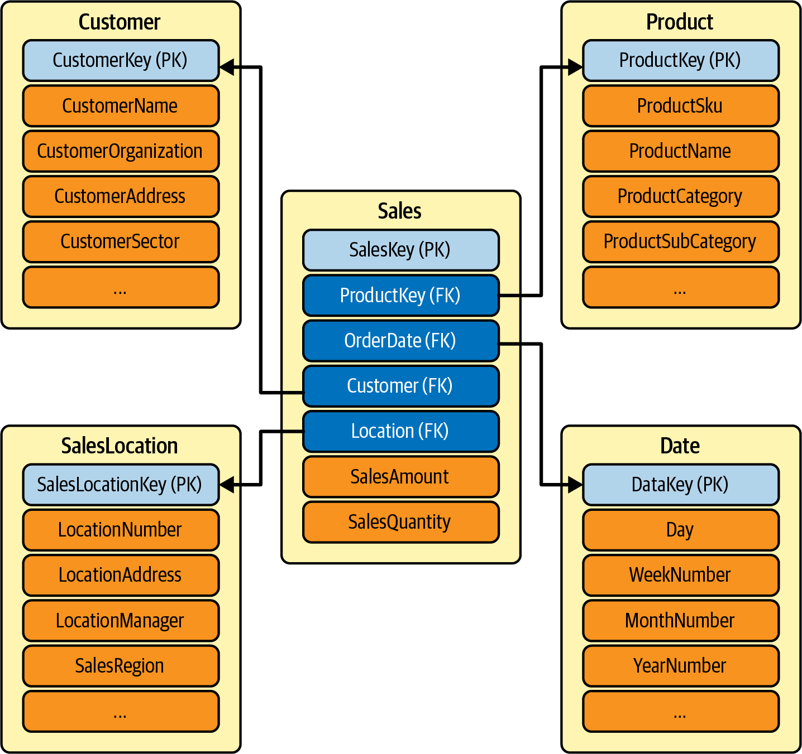

#### 데이터웨어하우스의 특징
* 공통된 스키마를 통해 정제되고 정규화된 고품질 데이터를 제공합니다
* 시간 차원을 기본으로 저장 및 처리하므로 과거로부터 현재까지의 기간 추세분석을 통한 통찰력을 제공합니다
* ACID 한 트랜잭션을 제공하며, 스타 스키마 모델링 기반의 팩트 및 요약 테이블을 통해 다양한 분석이 가능합니다
* 기본적으로 "어떤 사건이 발생했는가?"라는 질문을 해결하는 비즈니스 인텔리전스 서비스라고 볼 수 있습니다
* 다만, 대용량 데이터의 4V(Volume, Velocity, Variety, Veracity 등) 문제를 해소하기는 어렵습니다

#### 데이터레이크 소개
> 초기 데이터레이크는 아파치 하둡 프레임워크를 기반으로 온프레미스 클러스터로 구축되었습니다
> 하둡 서비스 상에 다양한 오픈소스 에코시스템을 활용하여 빅데이터 처리를 위한 환경을 구성할 수 있습니다
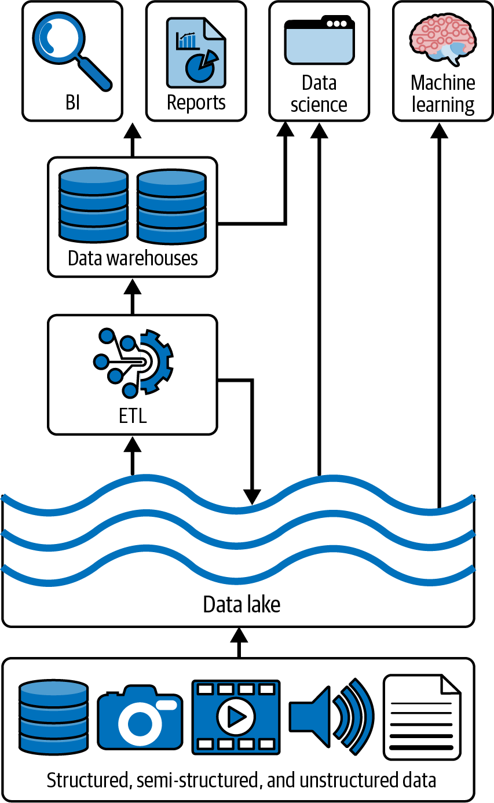

#### 데이터레이크의 특징
* 하둡은 분산 저장소(스토리지), 컴퓨팅 엔진을 제공하며, 오픈소스 에코시스템을 통해 다양한 포맷 및 메타데이터를 활용할 수 있습니다
* 저장 및 처리 시스템의 확장 및 배포가 안정적으로 가능하며, 비정형 데이터를 포함한 모든 데이터 유형을 지원합니다
* 데이터를 수집하는 것과 이러한 데이터를 비즈니스 가치를 제공하는 형식으로 변환 및 유지하는 데에는 많은 비용과 노하우가 필요하게 됩니다
* 조직의 데이터 팀은 데이터를 데이터 웨어하우스와 같은 것으로 변환하고 서빙하는 과정에서 가치 창출 시간이 지연될 수 있음을 알아야 합니다

> 데이터 레이크의 가장 핵심 가치는 **데이터 파이프라인의 자동화와 안정성** 그리고 **가치 창출에 필요한 데이터를 딜리버리 하는 시간을 단축**하는 데에 있다

#### 데이터 레이크 하우스
> Armbrust, Ghodsi, Xin, Zaharia 는 2021년에 데이터 레이크하우스 개념을 처음으로 도입했고, 이는 "ACID 트랜잭션, 데이터 버전관리, 감사
> 색인, 캐싱 및 쿼리 최적화" 등의 기술을 통해 데이터레이크 환경에서 데이터웨어하우스 기능을 제공하는 데이터 관리시스템으로 정의합니다
> 즉, 데이터레이크의 확장성, 처리 성능을 보장하면서 데이터웨어하우스의 트랜잭션, 스키마 모델링의 안정성을 보장하는 시스템입니다

#### 데이터 레이크하우스의 특징
> 데이터레이크와 같이 별도의 데이터 사본을 보관하고 저장할 필요가 없기 때문에, 데이터 이동이 줄어들고 ETL 단순화를 통해 품질 이슈를 줄입니다
> 대용량 데이터 저장과 정제된 차원 모델을 통해 개발주기 감소와 가치 창출에 이르는 시간을 단축할 수 있습니다
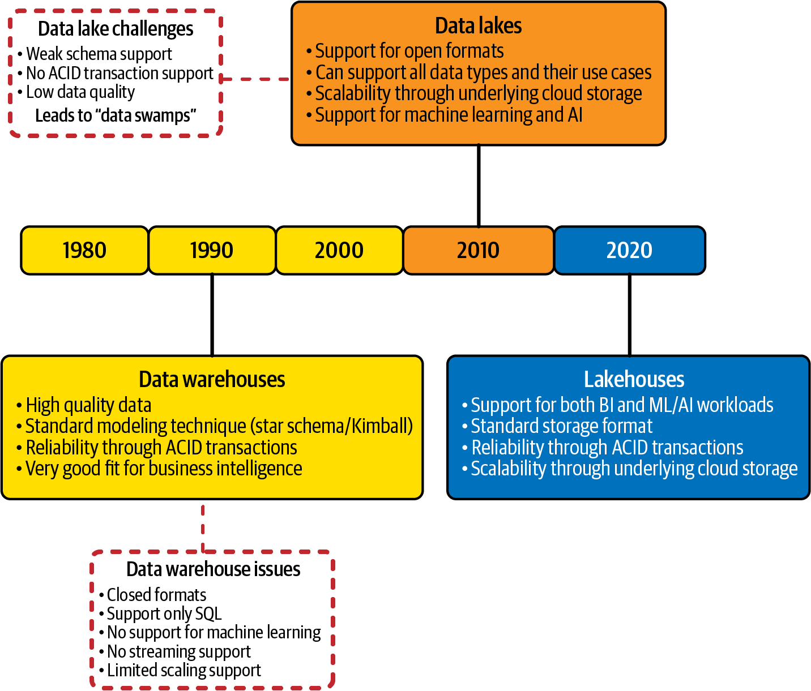

#### 델타 레이크
> 메타데이터, 캐싱 및 인덱싱을 스토리지 수준에서 제공하는 개방형 데이터 포맷(Parquet)을 지향하는 데이터 저장 프레임워크입니다
> 이는 ACID 트랜잭션, 감사, 히스토리 및 테이블 관리기능을 제공하는 추상화 수준을 API 및 SQL 수준에서 지원합니다

* ACID 트랜잭션, DML 지원, 감사, 배치/스트리밍 처리 통합, 스키마 에볼루션, 메타데이터 지원 등의 주요 기능이 제공됩니다
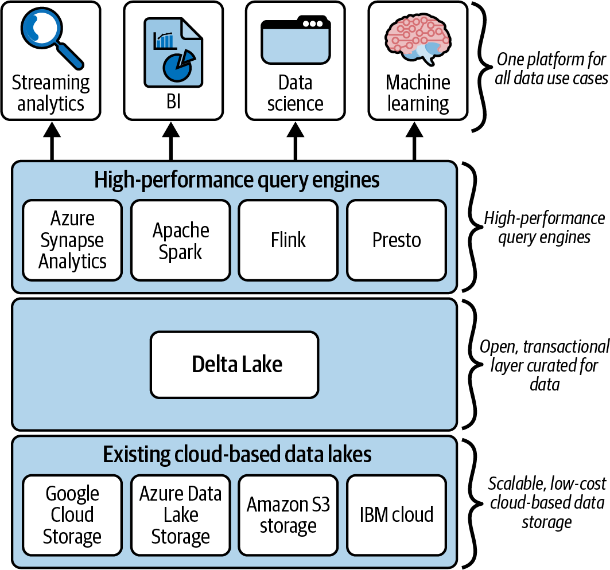

#### 메달리온 아키텍처
> 브론즈, 실버 및 골드 레이어로 데이터의 활용 및 특성에 따라 구분하는 데이터 관리 아키텍처를 말합니다
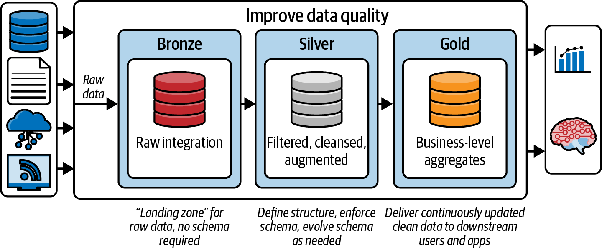

* 원본 데이터를 그대로 보관 및 저장하는 `브론즈`, 정규화, 정재 및 병합된 데이터가 보관되는 `실버` 그리고 안전하게 사용할 수 있는 팩트, 요약
* 테이블 등이 저장되는 `골드` 레이어로 구분됩니다

#### 결론
> 데이터의 양, 속도, 다양성 등을 고려할 때 데이터웨어하우스와 데이터레이크의 한계와 과제는 새로운 데이터 패러다임을 주도했습니다
> 델타 레이크와 같은 개방형 테이블 형식으로의 발전을 통해 제안된 데이터 레이크하우스 아키텍처는 이전 버전의 데이터 플랫폼의 통합이 가능했고
> 이를 통해 확장성, 안정성 및 다양한 기능을 제공하는 현대적인 데이터 아키텍처를 지원할 수 있었습니다


## 2. 델타 레이크 시작하기
> '트랜잭션 보장', 'DML 지원', '감사', '통합 스트리밍 및 배치 모델', '스키마 강제', '확장 가능한 메타데이터 모델' 지원에 대해 소개합니다

### 2-1. 실행 환경 구축
* [delta-for-dummies](https://github.com/psyoblade/delta-for-dummies) 프로젝트를 통해서 실행 환경 구축

### 2-2. 데이터 저장 포맷
> 델타 레이크는 기본적으로 Parquet 포맷을 활용하기에 기존 테이블과 호환성을 보장하며, 추가적인 메타데이터를 활용하여 INSERT, UPDATE,
> DELETE 와 같은 RDBMS 에서 지원하는 DML 작업을 수행할 수 있습니다. 테이블 저장 경로에 생성되는 `_delta_log` 아래에 트랜잭션 로그가
> 생성 및 관리되는데, 이러한 트랜잭션 로그를 통해서 어떻게 ACID 한 트랜잭션을 지원하는 지를 이해합니다

#### Parquet 파일
* 로우 기반 파일포맷과, 열 기반 파일 포맷의 차이점
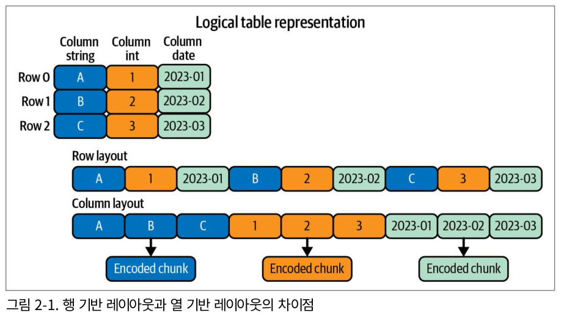

* 열 기반 파일 포맷의 장점
  * 컬럼의 데이터 유형에 따라 유연한 압축 옵션과, 확장 가능한 인코딩 스키마를 지원하여 열 단위 압축에 효율적입니다
  * 행 및 열 그룹에 대한 통계정보(최소값, 최대값 및 빈도 등) 및 데이터 스키마를 가지기 때문에 데이터 읽기에 효과적입니다

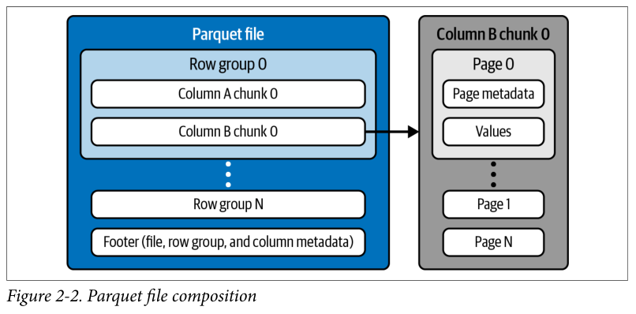

* 파케이 파일의 장점
  * 열 단위 데이터 저장
    * 개별 열에 저장된 유형에 맞는 압축 및 인코딩 알고리즘 활용으로 저장 및 읽기 성능을 향상시킵니다
    * 컬럼 프로젝션 시에 `Column Pruning` 기법을 통해 네트워크 및 디스크 I/O 를 줄여 성능을 향상 시킵니다
  * 메타데이터 저장
    * 행 그룹, 데이터 스키마, 및 열에 대한 정보(최대, 최소, 빈도 등)를 저장합니다
    * 열 통계정보를 활용하여 특정 블록을 건너뛰는 `Data Skipping` 과 같은 기법을 활용하여 I/O 성능 향상을 기대할 수 있습니다
  * 유형 별 압축 및 인코딩
    * 컬럼 단위 압축을 통해 압축률을 극대화 하여, 디스크 저장공간을 효과적으로 사용합니다
  * 표준화된 파일 포맷 지원
    * 빅 데이터 처리 플랫폼의 표준 데이터 포맷인 Parquet 포맷을 지원함으로써 뛰어난 상호 운용성을 제공합니다


```python
dataframe.write.format("delta").mode("overwrite").partitionBy("salary").saveAsTable("default.family")
```
* 예제 코드 수행 이후에 `_delta_log` 경로의 트랜잭션 로그 `00000000000000000000.json` 확인
```json
{"protocol":{"minReaderVersion":1,"minWriterVersion":2}}
{"metaData":{"id":"cdb1e796-710d-4813-8174-c1f168fdedb3","format":{"provider":"parquet","options":{}},"schemaString":"{\"type\":\"struct\",\"fields\":[{\"name\":\"id\",\"type\":\"integer\",\"nullable\":true,\"metadata\":{}},{\"name\":\"name\",\"type\":{\"type\":\"struct\",\"fields\":[{\"name\":\"firstName\",\"type\":\"string\",\"nullable\":true,\"metadata\":{}},{\"name\":\"middleName\",\"type\":\"string\",\"nullable\":true,\"metadata\":{}},{\"name\":\"lastName\",\"type\":\"string\",\"nullable\":true,\"metadata\":{}}]},\"nullable\":true,\"metadata\":{}},{\"name\":\"gender\",\"type\":\"string\",\"nullable\":true,\"metadata\":{}},{\"name\":\"birthDate\",\"type\":\"string\",\"nullable\":true,\"metadata\":{}},{\"name\":\"ssn\",\"type\":\"string\",\"nullable\":true,\"metadata\":{}},{\"name\":\"salary\",\"type\":\"integer\",\"nullable\":true,\"metadata\":{}}]}","partitionColumns":["salary"],"configuration":{},"createdTime":1723180643772}}
{"add":{"path":"salary=1000/part-00002-6e0802ce-200d-43f3-8e34-924357eb2952.c000.snappy.parquet","partitionValues":{"salary":"1000"},"size":2130,"modificationTime":1723180644150,"dataChange":true,"stats":"{\"numRecords\":1,\"minValues\":{\"id\":1,\"name\":{\"firstName\":\"suhyuk\",\"middleName\":\"psyoblade\",\"lastName\":\"park\"},\"gender\":\"male\",\"birthDate\":\"2000/10/30\",\"ssn\":\"741030\"},\"maxValues\":{\"id\":1,\"name\":{\"firstName\":\"suhyuk\",\"middleName\":\"psyoblade\",\"lastName\":\"park\"},\"gender\":\"male\",\"birthDate\":\"2000/10/30\",\"ssn\":\"741030\"},\"nullCount\":{\"id\":0,\"name\":{\"firstName\":0,\"middleName\":0,\"lastName\":0},\"gender\":0,\"birthDate\":0,\"ssn\":0}}"}}
{"add":{"path":"salary=2000/part-00005-dc386f3a-fe53-4c36-a86b-9a89e0eae250.c000.snappy.parquet","partitionValues":{"salary":"2000"},"size":2109,"modificationTime":1723180644150,"dataChange":true,"stats":"{\"numRecords\":1,\"minValues\":{\"id\":2,\"name\":{\"firstName\":\"youngmi\",\"middleName\":\"kiki\",\"lastName\":\"kim\"},\"gender\":\"female\",\"birthDate\":\"2004/08/08\",\"ssn\":\"770808\"},\"maxValues\":{\"id\":2,\"name\":{\"firstName\":\"youngmi\",\"middleName\":\"kiki\",\"lastName\":\"kim\"},\"gender\":\"female\",\"birthDate\":\"2004/08/08\",\"ssn\":\"770808\"},\"nullCount\":{\"id\":0,\"name\":{\"firstName\":0,\"middleName\":0,\"lastName\":0},\"gender\":0,\"birthDate\":0,\"ssn\":0}}"}}
{"add":{"path":"salary=3000/part-00008-14a500de-d029-4249-94fe-5074c2396313.c000.snappy.parquet","partitionValues":{"salary":"3000"},"size":2096,"modificationTime":1723180644150,"dataChange":true,"stats":"{\"numRecords\":1,\"minValues\":{\"id\":3,\"name\":{\"firstName\":\"sowon\",\"middleName\":\"eva\",\"lastName\":\"park\"},\"gender\":\"female\",\"birthDate\":\"2005/05/20\",\"ssn\":\"040520\"},\"maxValues\":{\"id\":3,\"name\":{\"firstName\":\"sowon\",\"middleName\":\"eva\",\"lastName\":\"park\"},\"gender\":\"female\",\"birthDate\":\"2005/05/20\",\"ssn\":\"040520\"},\"nullCount\":{\"id\":0,\"name\":{\"firstName\":0,\"middleName\":0,\"lastName\":0},\"gender\":0,\"birthDate\":0,\"ssn\":0}}"}}
{"add":{"path":"salary=4000/part-00011-eec39bf9-8b74-402b-a0d1-29ba6f91a471.c000.snappy.parquet","partitionValues":{"salary":"4000"},"size":2089,"modificationTime":1723180644150,"dataChange":true,"stats":"{\"numRecords\":1,\"minValues\":{\"id\":4,\"name\":{\"firstName\":\"sihun\",\"middleName\":\"sean\",\"lastName\":\"park\"},\"gender\":\"male\",\"birthDate\":\"2006/01/14\",\"ssn\":\"080114\"},\"maxValues\":{\"id\":4,\"name\":{\"firstName\":\"sihun\",\"middleName\":\"sean\",\"lastName\":\"park\"},\"gender\":\"male\",\"birthDate\":\"2006/01/14\",\"ssn\":\"080114\"},\"nullCount\":{\"id\":0,\"name\":{\"firstName\":0,\"middleName\":0,\"lastName\":0},\"gender\":0,\"birthDate\":0,\"ssn\":0}}"}}
{"commitInfo":{"timestamp":1723180644301,"operation":"CREATE OR REPLACE TABLE AS SELECT","operationParameters":{"isManaged":"true","description":null,"partitionBy":"[\"salary\"]","properties":"{}"},"isolationLevel":"Serializable","isBlindAppend":false,"operationMetrics":{"numFiles":"4","numOutputRows":"4","numOutputBytes":"8424"},"engineInfo":"Apache-Spark/3.2.1 Delta-Lake/2.0.0","txnId":"33e8e5ec-fa5a-4e47-a051-73e80c16b684"}}
```
* 프로토콜, 테이블 스키마를 정의, 4개의 파티션을 추가 후, 커밋 로그를 저장하는 과정이 하나의 트랜잭션을 구성한다
* `Delta Lake 3.0 (Spark 3.5.0)` 에서는 `Uniform(Universal Format)`을 통해 다양한 포맷(Iceberg, Hudi 등)을 읽을 수 있습니다

```sql
CREATE TABLE T TBLPROPERTIES( 'delta.columnMapping.mode' = 'name', 'delta.universalFormat.enabledFormats' = 'iceberg')
AS SELECT * FROM source_table;
```

> 이와 같이 `_delta_log` 경로에는 데이터에 대해 수행된 모든 단일 작업이 포함된 트랜잭션 로그를 저장합니다.


### 2-3. 트랜잭션 로그
> 델타 레이크 트랜잭션 로그는, 델타 테이블 생성 이후 수행된 모든 트랜잭션의 순차적인 레코드를 저장하는 아카이브 로그입니다. 이는 ACID 한
> 트랜잭션, 확장 가능한 메타데이터 처리, 시간 여행 등 주요기능을 수행하기 위한 델타 레이크의 핵심 정보입니다

#### 트랜잭션 로그의 특징
* 다수의 `Reader` 와 `Writer` 가 특정 버전의 데이터 집합에 대해 동시에 작업
* 효율적인 읽기 쓰기를 위한 `Data Skipping` 을 위한 추가정보 관리 및 제공
* 항상 이용자에게 일관된 보기와 단일 정보 소스(`Truth of Source`) 제공
* 델타 테이블의 모든 변경사항을 저장하는 중앙 저장소 역할

#### 트랜잭션 로그를 읽는 시점
* `Reader`가 델타 테이블 최초로 읽거나, 마지막으로 읽은 이후에 수정된 열린 파일에 대해 새로운 쿼리 수행하는 경우 트랜잭션 로그를 읽습니다
* 즉, 트랜잭션 로그에는 성공한 모든 트랜잭션만 남기 때문에 해당 최신 버전을 읽을 수 있습니다

#### 트랜잭션 로그를 통해 원자성을 구현하는 방법
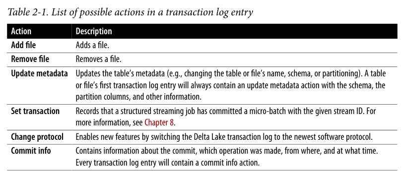
* 파일의 추가/삭제, 스키마/파티션 변경 등의 메타데이터 수정 및 커밋 정보가 포함됩니다
  * 모든 트랜잭션 로그 엔트리에는 오퍼레이션이 발생한 시간 등의 커밋 정보가 포함된 `Commit info` 섹션이 추가됩니다 
* 커밋이라는 순서가 단조증가하는 숫자로 구성된 `json` 파일로 기록됩니다
  * 이는 `Git`이 원격지에 코드 및 리소스에 대해 원자적 커밋으로 변경 사항을 추적하는 방법과 유사합니다
  * 이러한 트랜잭션 로그의 개별 커밋을 순차적으로 재생하여 파일의 최종 상태를 얻을 수 있습니다

#### 델타 레이크 데이터 쓰기
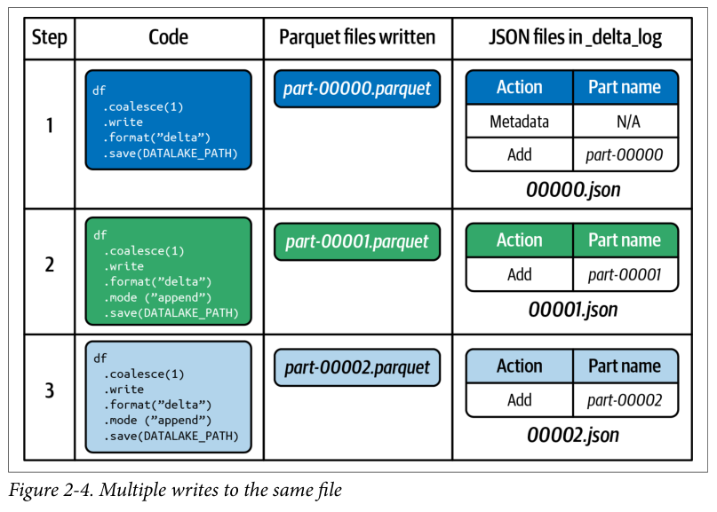
* 델타 테이블이 지정된 경로에 데이터를 `part-00000.parquet` 저장하고, 트랜잭션 로그 항목이 `_delta_log/00000.json` 저장

> 각 쓰기 작업마다 항상 데이터 파일이 먼저 기록되고, 해당 작업이 모두 성공한 경우에만 트랜잭션 로그 파일이 저장됩니다.
> 즉, ***트랜잭션 로그가 성공적으로 기록된 경우에만 모든 트랜잭션이 완료된 것으로 간주***합니다

#### 델타 레이크 데이터 읽기
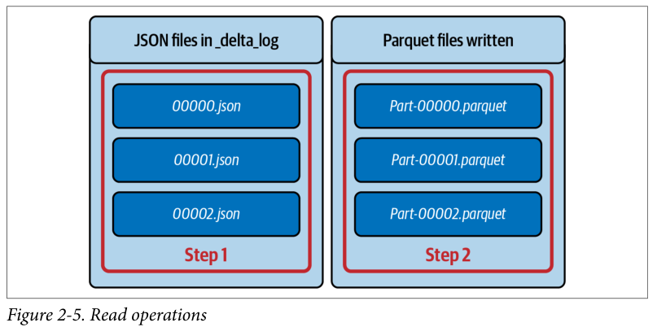
* 트랜잭션 로그 파일(`00000.json ~ 00002.json`)을 가장 먼저 읽고, 로그 파일을 기반으로 데이터 파일을 읽습니다
* UPDATE, DELETE 등의 연산에 의해 더 이상 참조되지 않는 파일이 있을 수 있으며, 이는 `VACUUM` 명령을 통해 삭제될 수 있습니다

#### 쓰기 실패가 발생한 경우
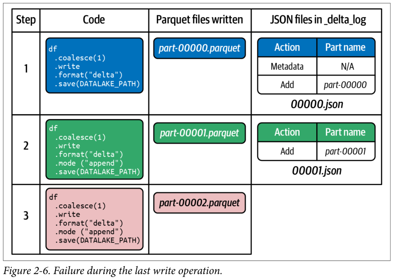
* 3번째 작업 수행 시에 데이터는 저장되었으나, 트랜잭션 로그 생성에 실패한 경우, 일관되지 않은 데이터는 읽지 않습니다.
* 이러한 가비지 데이터는 즉각적으로 삭제되지 않으며, `VACUUM` 등의 동작을 통해 안전하게 제거됩니다

#### 데이터 업데이트
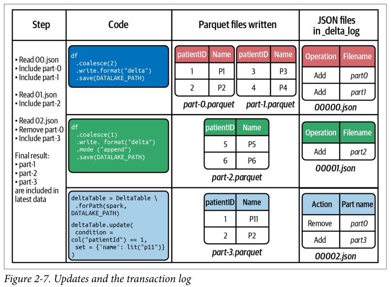
* 트랜잭션 로그를 통해 `part-0 ~ part-2` 까지 읽어온 뒤
* `pationtID` 값이 1인 경우만 변경된 `part-3` 파일을 생성하여 추가

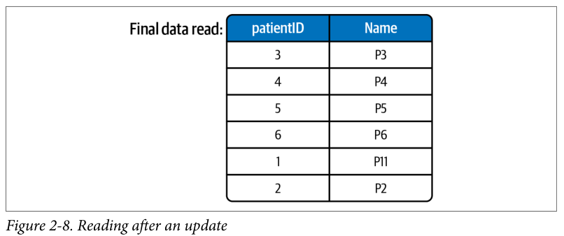
* `00000.json` 파일을 통해 `part-0 ~ part-1` 읽기
* `00001.json` 파일을 통해 `part-2` 읽기
* `00002.json` 파일을 통해 `part-0` 제거 후, `part-3` 읽기 
* 결국 `part-1,2,3` 을 읽게되어 일관된 데이터를 읽을 수 있습니다

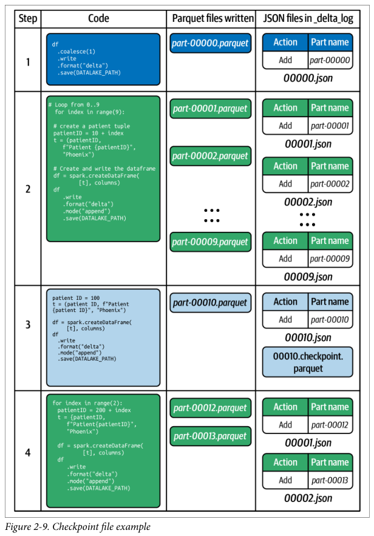
* 너무 많은 트랜잭션 로그가 발생하는 경우 스파크 읽기 성능에 악영향을 미칠 수 있으므로 체크포인트 작업을 통해서 최적화 합니다
* 매 10회의 트랜잭션 `00000.json ~ 000009.json` 작업 이후 트랜잭션 생성(11번째)시에 체크포인트 작업을 생성합니다
* `00010.json + 00010.checkpoint.parquet` 와 같이 총 11개의 트랜잭션을 하나로 압축하여 파케이 파일로 저장합니다
* 이와 같이 트랜잭션 로그는 과거의 모든 기록을 유지하고 있기 때문에 초기 메타데이터 로딩시에 오버헤드가 있을 수 있습니다
  * 트랜잭션 로그는 강제로 삭제되지 않으며, 자동삭제 되는데 기본 설정이 30일이므로, 스트리밍 테이블의 경우 사전에 조율이 필요합니다


## 3. 델타 테이블 기본 연산자
> 델타 테이블은 SQL DDL/DML, Python DataFrameWriter 혹은 DeltaTableBuilder API 등을 통해서 생성될 수 있으며, 다른 열 혹은 함수를 활용해서 자동 생성되는 `GENERATED` 컬럼을 통해 유연하고, 강력한 스키마 기능을 제공하며, `SQL INSERT 혹은 COPY INTO` 같은 명령어를 통해서 대량의 데이터를 신속하게 추가할 수 있습니다

### 3-1. 테이블 생성
* [Creating a Delta Table with SQL DDL](https://github.com/psyoblade/delta-for-dummies/blob/main/notebooks/3-1.%20delta-lake-create-table-with-sql.ipynb)
* [Creating Delta Tables with the DataFrameWriter API](https://github.com/psyoblade/delta-for-dummies/blob/main/notebooks/3-2.%20delta-lake-create-table-with-api.ipynb)

### 3-2. 데이터 읽기
* [Reading a Delta Table](https://github.com/psyoblade/delta-for-dummies/blob/main/notebooks/3-3.%20delta-lake-read-table.ipynb)

### 3-3. 데이터 쓰기
* [Writing to a Delta Table](https://github.com/psyoblade/delta-for-dummies/blob/main/notebooks/3-4.%20delta-lake-write-table.ipynb)


## 4. 테이블 삭제, 갱신 및 병합

### 4-1. 데이터 삭제
* [Deleting Data from a Delta Table](https://github.com/psyoblade/delta-for-dummies/blob/main/notebooks/4-1.%20delta-lake-delete-table.ipynb)
> 실제 삭제라는 연산은 데이터 파일 수준에서 일어나며, 새로운 파티션 생성으로 인한 데이터 파일이 추가되고, `add` 와 `remove` 액션이 트랜잭션 로그에서 발생함을 알 수 있다

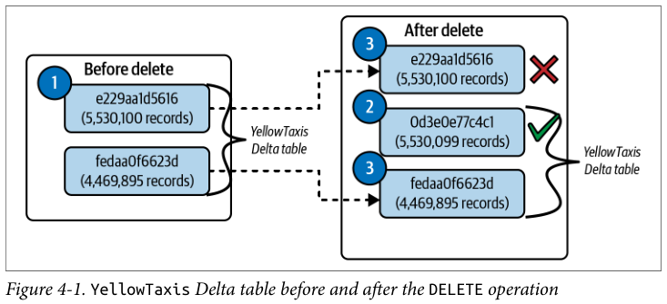
1. 가장 먼저, 조건에 해당(`predicate`)하는 파일`e229aa1d5616`을 찾고
2. 해당 데이터 파일을 메모리에 올린다음, 해당 레코드를 삭제한 후, 새로운 파일 `0d3e0e77c4c1`을 생성합니다
3. 기존에 사용되었던 파일을 트랜젝션 로그에 `DELETE` 오퍼레이션을 남기고, `tombstoning` 이라 지칭하며, 해당 파일은 `VACUUM` 커맨드가 수행되기 전까지는, 삭제되지는 않으며 현재 버전에서는 조회되지 않습니다. 또한 `Time travel` 기능을 통해서 삭제된 데이터도 조회가 가능합니다
4. 데이터 파일 `fedaa0f6623d` 는 영향이 없기 때문에 그대로 유지됩니다

#### DELETE Performance Tuning Tips
> 삭제 성능에 가장 영향을 많이 미치는 요소는 삭제 대상 파티션에 대한 정보를 잘 알고 있고, 이를 최대한 줄일 수 있는 `DELETE predicate` 를 찾는 방법이다
> 결국 삭제 대상이 되는 조건의 파티션이 뭉쳐있다면 새로운 파티션 생성도 줄어들어 I/O 효과를 누릴 수 있기 때문인데, `data skipping`, `z-order` 등의
> 기법을 통해서 자주 사용되는 컬럼에 대해 최적화된 상태로 파티션을 유지할 수 있는 방법을 검토해볼 필요가 있겠다


### 4-2. 데이터 갱신
* [Updating Data in a Table](https://github.com/psyoblade/delta-for-dummies/blob/main/notebooks/4-2.%20delta-lake-update-table.ipynb)
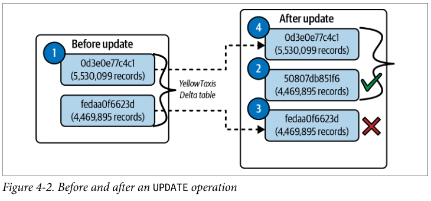
1. 가장 먼저, 갱신 조건에 해당(`predicate`)하는 파일`fedaa0f6623d`을 찾고 `input_file_name()` 함수를 통해 파일 명을 확인할 수 있다
2. 해당 데이터 파일을 메모리에 올린다음, 해당 레코드를 갱신한 후, 새로운 파일 `50807db851f6`을 생성합니다. 성공적으로 파일이 추가되었다면 `add` 액션을 트랜잭션 로그에 작성합니다
3. 데이터 파일 `0d3e0e77c4c1` 는 영향이 없기 때문에 그대로 유지됩니다

#### UPDATE Performance Tuning Tips
> 삭제와 마찬가지로 갱신에 성능에 가장 영향을 많이 미치는 요소는 갱신 대상 파티션에 범위를 줄일 수 있는 `UPDATE predicate` 를 찾는 것입니다


### 4-3. 데이터 병합
* [Upsert Data Using the MERGE Operation](https://github.com/psyoblade/delta-for-dummies/blob/main/notebooks/4-3.%20delta-lake-merge-table.ipynb)
> 데이터 병합은 UPSERT 연산으로 동작하므로 INSERT or UPDATE 이므로 내부 동작은 특별한 것은 없다

```sql
%sql
MERGE INTO taxidb.YellowTaxis AS target
  USING YellowTaxiMergeData AS source
  ON target.RideId = source.RideId
-- You need to update the VendorId if the records matched
WHEN MATCHED THEN
-- If you want to update all columns, you can say "SET *"
  UPDATE SET target.VendorId = source.VendorId
WHEN NOT MATCHED THEN
-- If all columns match, you can also do a "INSERT *"
  INSERT(RideId, VendorId, PickupTime, DropTime, PickupLocationId,
    DropLocationId, CabNumber, DriverLicenseNumber, PassengerCount,
    TripDistance, RateCodeId, PaymentType, TotalAmount, FareAmount,
    Extra, MtaTax, TipAmount, TollsAmount, ImprovementSurCharge)
  VALUES(RideId, VendorId, PickupTime, DropTime, PickupLocationId,
    DropLocationId, CabNumber, DriverLicenseNumber, PassengerCount,
    TripDistance, RateCodeId, PaymentType, TotalAmount, FareAmount,
    Extra, MtaTax, TipAmount, TollsAmount, ImprovementSurCharge)    
```

1. Merge 수행할 테이블에 대해 `YellowTaxis` 라는 테이블 alias 를 걸어두었고
2. `USING` 구문을 통해서 소스 및 타깃 테이블을 구분하기 위해 명시적인 source, target alias 를 사용합니다
3. Join 수행을 위해 파티션 키에 해당하는 `VendorId` 를 활용하였고
4. 가장 처음에 지정한 `ON` 구문에 `RideId` 가 매치되는 source 와 target 레코드에 대해 action 을 수행하며, 변경하고자 하는 컬럼이 하나인 경우 `SET` 구문에 하나만, 다수인 경우 콤마로 구분하여 지정하되 `UPDATE SE *` 을 통해 전체를 업데이트 할 수 있습니다
5. 매치되는 레코드가 타깃에 없다면 `INSERT` 명령을 수행하게 되고 모든 컬럼이 일치한다면 `INSERT *` 구문을 사용합니다

> 참고로 `ON` 절에 의해 매칭되는 레코드가 다수인 경우에는 다수의 레코드에 대해 `UPDATE` 될 수 있음에 유의해야 합니다


#### 원본 테이블에 없는 레코드 다루기 (Modifying unmatched rows using MERGE)
> 타깃 테이블에는 존재하지만, 소스 테이블에는 존재하지 로우에 대해서 타깃 테이블에 컬럼을 업데이트 하거나 삭제하는데 아주 유용하게 활용될 수 있는 `WHEN NOT MATCHED BY SOURCE` 구문이다 (단, Delta Lake API 는 2.3, SQL 은 2.4 버전부터 지원)

* 소스 테이블과 매칭되는 경우 update, 타깃 테이블에 없는 경우 insert, 소스 테이블에 없는 경우 delete
```sql
%sql
MERGE INTO taxidb.YellowTaxis AS target
  USING YellowTaxiMergeData AS source
    ON target.RideId = source.RideId
WHEN MATCHED
UPDATE SET *
  WHEN NOT MATCHED
INSERT *
-- DELETE records in the target that are not matched by the source
WHEN NOT MATCHED BY SOURCE
DELETE
```
* 데이터가 source = { 1, 2, 3 }, target = { 2, 3, 4 } 라고 가정한다면
  * matched : update (2, 3)
  * not matched : insert (1)
  * not matched by source : delete (4)

* delete 가 불편하다면 soft delete 에 해당하는 상태를 변경하는 것도 가능하다
```sql
%sql
MERGE INTO taxidb.YellowTaxis AS target
  USING YellowTaxiMergeData AS source
    ON target.RideId = source.RideId
WHEN MATCHED
  UPDATE SET *
WHEN NOT MATCHED
  INSERT *
-- Set target.status = 'inactive' when records in the target table don’t exist in the source table and condition is met
WHEN NOT MATCHED BY SOURCE target.PickupTime >= (current_date() - INTERVAL '5' DAY) THEN
  UPDATE SET target.status = 'inactive'
```
* 안전하게 유지할 수 있지만, 대상 데이터가 너무 많은 경우 갱신되는 레코드가 많을 수 있으므로 최근 5일간 데이터에 대해서만 처리(update or delete)하게 할 수도 있습니다
* `WHEN NOT MATCHED BY SOURCE` 구문의 경우 여러개의 조건에 해당하는 조치를 수행할 수 있으며, 마지막 구문(else)을 제외한 모든 절은 반드시 조건(else if)이 필요합니다


### 4-4. 히스토리 정보를 통한 병합 연산 분석
> `DESCRIBE HISTORY` 명령을 통해 `MERGE` 연산에 대한 상세 정보를 `operationParameters 라는 섹션에서 확인할 수 있는데
* operationParameters
```text
{
    predicate -> ((target.RideId = source.RideId) AND (target.VendorId = source.VendorId))
    , matchedPredicates -> [{"actionType":"update"}]
    , notMatchedPredicates -> []
}
```
* operationMetrics
```text
{
    numTargetRowsCopied -> 0
    , numTargetRowsDeleted -> 0
    , numTargetFilesAdded -> 2
    , executionTimeMs -> 973
    , numTargetRowsInserted -> 0
    , scanTimeMs -> 434
    , numTargetRowsUpdated -> 2
    , numOutputRows -> 2
    , numTargetChangeFilesAdded -> 0
    , numSourceRows -> 1
    , numTargetFilesRemoved -> 2
    , rewriteTimeMs -> 466
}
```

* 델타레이크 내부에서 병합 연산이 발생할 때 순서
1. 우선 소스와 타깃 테이블의 `inner join` 이 수행을 통해, 불필요한 셔플링을 피할 수 있습니다
2. 동일한 두 테이블에 대해 `outer join` 을 통해, INSERT, DELETE 그리고 UPDATE 를 수행합니다

* 완전히 동일하지 않으나 아래와 같은 방식을 상상해볼 수 있겠다 
```sql
# FULL OUTER JOIN을 사용한 SQL 쿼리
inner_join = spark.sql("""
    SELECT *
    FROM a
     JOIN b
    ON a.aid = b.bid
""")

# 결과 출력
inner_join.show()

# FULL OUTER JOIN을 사용한 SQL 쿼리
outer_join = spark.sql("""
    SELECT *
    FROM a
    FULL OUTER JOIN b
    ON a.aid = b.bid
    WHERE a.aid IS NULL OR b.bid IS NULL
""")

# 결과 출력
outer_join.show()
```
> 위에서는 동일한 연산이라고 표현했지만 순수하게 연산이 같다는 의미이지 MERGE 동작의 내부 방식은 완전히 다르게 동작합니다


## 5. 성능 튜닝
>  일반적인 성능 튜닝이라함은 시스템 성능을 최적화 과정을 말하며, 델타 테이블의 경우 데이터의 저장 및 검색의 최적화를 의미합니다, 역사적으로 데이터 검색의 향상을 위해서는 더 많은 RAM, CPU 혹은 데이터 건너뛰기를 통해 읽는 데이터의 양을 줄이는 접근을 했습니다. 여기서 델타 레이크는 데이터 처리 과정에서 읽어야 하는 파일 및 데이터의 양을 효율적으로 줄여 검색을 가속화하는 방법론을 사용하며, 검색 속도에 악영향을 미치는 또 다른 요소는 `Small File Problem` 이며, 빈번하게 쓰기가 발생하는 경우 압축 등을 통해 해결합니다
>  정리하면 좋은 성능튜닝 접근방법은 작은 파일문제에 의한 영향을 줄이고, 데이터 건너뛰기를 효과적으로 활성화 하도록 하여 성능을 향상시킬 수 있습니다

### 5-1. 데이터 건너뛰기
* 통계 메타정보 관리를 통한 데이터 건너뛰기
  * 최대 32개 필드에 대한 최소/최대값 등의 통계정보를 메타데이터로 저장하고, 이러한 값의 범위를 통해 해당 파일 블록을 건너뜁니다
  * 별도로 설정하지 않아도 활성화되어 있지만, `OPTIMIZE` 및 `ZORDER BY` 명령을 통해 의도적으로 수정 및 최적화 할 수 있습니다
* 데이터 건너뛰기를 위한 통계정보
  * 레코드 수
  * 처음 32개 열 각각의 최소값
  * 처음 32개 열 각각의 최대값
  * 처음 32개 열 각각에 대한 Null 값 수
* 통계정보 수집에 대한 상세정보
  * 중첩된 열(`StructType`)의 경우 각 필드 모두 열로 계산
* `delta.dataSkippingNumIndexedCols` 통해 최대 열의 수를 조정 가능
  * 너무 많은 열은 오버헤드가 발생하므로 `WHERE` 및 `JOIN`에 활용되는 열에 대한 통계수집을 추천
  * 너무 긴 문자열의 경우도 건너뛰기 효과보다, 통계 수집에 드는 비용이 더 크기 때문에 비추천
```sql
ALTER TABLE
  table_name
SET TBLPROPERTIES ('delta.dataSkippingNumIndexedCols' = '<value>');
```
* 트랜잭션 로그에 아래와 같이 `stats` 정보가 같이 남게되며 이러한 정보를 통해서 건너뛰기가 가능함
```shell
{
    "add": {
        "path": "part-00000-a2bcac59-0d4f-40f8-bcdb-57e66bbb00f2-c000.snappy.parquet",
        "partitionValues": {},
        "size": 5252,
        "modificationTime": 1724848669406,
        "dataChange": true,
        "stats": "{\"numRecords\":1,\"minValues\":{\"RideId\":9999995,\"VendorId\":1,\"PickupTime\":\"2019-11-01T09:00:00.000+09:00\",\"DropTime\":\"2019-11-01T09:02:23.573+09:00\",\"PickupLocationId\":65,\"DropLocationId\":71,\"CabNumber\":\"TAC304\",\"DriverLicenseNumber\":\"453987\",\"PassengerCount\":5,\"TripDistance\":4.5,\"RatecodeId\":1,\"PaymentType\":1,\"TotalAmount\":20.34,\"FareAmount\":15.0,\"Extra\":0.5,\"MtaTax\":0.4,\"TipAmount\":2.0,\"TollsAmount\":2.0,\"ImprovementSurcharge\":1.1},\"maxValues\":{\"RideId\":9999995,\"VendorId\":1,\"PickupTime\":\"2019-11-01T09:00:00.000+09:00\",\"DropTime\":\"2019-11-01T09:02:23.573+09:00\",\"PickupLocationId\":65,\"DropLocationId\":71,\"CabNumber\":\"TAC304\",\"DriverLicenseNumber\":\"453987\",\"PassengerCount\":5,\"TripDistance\":4.5,\"RatecodeId\":1,\"PaymentType\":1,\"TotalAmount\":20.34,\"FareAmount\":15.0,\"Extra\":0.5,\"MtaTax\":0.4,\"TipAmount\":2.0,\"TollsAmount\":2.0,\"ImprovementSurcharge\":1.1},\"nullCount\":{\"RideId\":0,\"VendorId\":0,\"PickupTime\":0,\"DropTime\":0,\"PickupLocationId\":0,\"DropLocationId\":0,\"CabNumber\":0,\"DriverLicenseNumber\":0,\"PassengerCount\":0,\"TripDistance\":0,\"RatecodeId\":0,\"PaymentType\":0,\"TotalAmount\":0,\"FareAmount\":0,\"Extra\":0,\"MtaTax\":0,\"TipAmount\":0,\"TollsAmount\":0,\"ImprovementSurcharge\":0}}"
    }
}
```

### 5-2. 파티셔닝
> 스파크에서 사용하는 데이터프레임 관련 파티션 개념이 아니라 하이브의 디렉토리 기준의 '파티셔닝' 구성을 의미하며, 델타 레이크에서는 이러한 파티셔닝을 개선한 리퀴드 클러스터링 기법 또한 추후에 소개합니다. 다만 현재 시점의 리퀴드 클러스터링은 프리뷰 버전이며 기존 파티셔닝 방식과 호환성을 보장하지 않습니다 
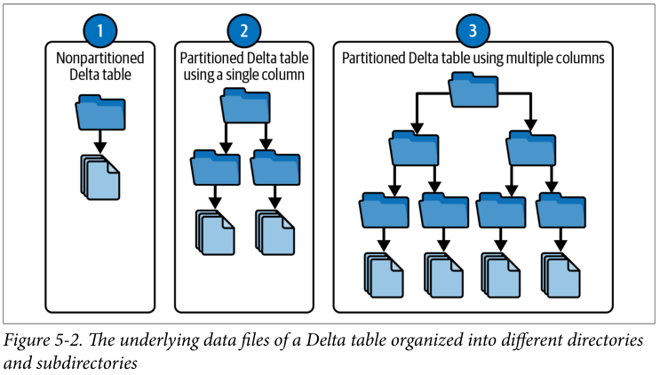

* 파티션 구성이 읽기 성능을 높일 수 있지만 반면에, 스몰파일 문제를 발생시킬 수도 있다
* 하이브가 매 요청시 마다 메타스토어를 읽는 것과 다르게, 테이블에 존재하는 모든 파티션 정보를 추적하고 업데이트 하고 있어서 데이터 읽기 및 쓰기 등의 연산에 있어 효과적으로 동작합니다
  * 변경된 스키마(컬럼의 추가 등)는 저장 시에 `.option("overwriteSchema", "true")` 옵션으로 업데이트가 가능합니다
* 데이터를 읽을 때에, 파티션 조건이 포함되는 경우 정확하게 일치하는 파티션만 읽어들이며 `.where("PickupMonth == '12' and PaymentType == '3' ")` 이를 델타로 다시 저장 시에도 전체를 읽지 않고 특정 파티션에 대해서만 업데이트 하기위해 `.option("replaceWhere", "PickupMonth = '12'")` 와 같은 표현식을 사용할 수 있습니다
  * 위의 `replaceWhere` 옵션 지정 시에는 스키마가 `overwrite` 될 수 없습니다
* 특히 `OPTIMIZE`,`ZORDER BY` 같은 컴팩션 작업과 조합해서 사용하는 경우 최적의 성능을 낼 수 있습니다
  * `OPTIMIZE taxidb.tripData WHERE PickupMonth = 12 ZORDER BY tpep_pickup_datetime`
  * 이런 최적화의 경우에는 `.option("dataChange", "false")` 로 설정하여 히스토리에 남기지 않습니다

### 5-3. 파티셔닝 경고 및 고려 사항
* 높은 카디낼러티를 가진 컬럼은 `Small file problem` 회피를 위해 파티셔닝 대신 `Z-ordering` 을 추천합니다
* 일반적으로 파티션 당 최소 1GB 이상의 데이터가 예상될 때에 파티셔닝을 검토하면 좋습니다
* 명시적으로 지정하지 않는 한, 파티셔닝 컬럼은 테이블 스키마의 가장 마지막에 위치합니다
* 한 번 생성된 파티션은 변경할 수 없으며, 마치 `fixed data layout` 으로 간주됩니다
* 정해진 `silver bullet`은 없으며 데이터의 `granularity, ingestion and update pattern` 을 고려하여 가이드라인에 따라 파티셔닝을 설계하는 방법이 최신입니다

### 5-4. 컴팩트 파일
* 델타 테이블에 DML 수행 이후 다수의 작은파일의 발생가능성이 있다면 최소 16MB 이상의 큰 크기의 파일들로 저장하는 최적화 수행이 필요하다

#### Compaction
* 최적화 작업은 `compaction` 혹은 `bin-packing` 이라고 부르며, 전통적인 최적화 기법 중의 하나인 파티션 구성 및 파티션 수를 조정하는 연산에 해당하며, `dataChange=false` 옵션으로 수행이 필요합니다
  * 델타 테이블의 기본 컴팩션 옵션은 `dataChange=true` 인데, 대상 테이블이 스트리밍 소스로 사용되는 경우, true 속성의 컴팩션은 테이블에 동시성 연산(`concurrent operations`) 이 중단될 수 있기 때문에 데이터의 변경이 없는 최적화(파티션 수 조정 등)의 경우 false 설정이 필요합니다
  * 여기서의 Compaction 은 일반적인 데이터 프레임 연산을 통한 최적화를 말하며, 명시적인 `optimize`, `vacuum` 과 같은 api 연산은 기본 설정이 false 입니다

#### OPTIMIZE
* 트랜잭션 로그에서 사용되지 않는 불필요한 파일들을 제거하고, 일정한 크기로 밸런스를 맞출 수 있도록 파일의 크기를 조정하는 것이 옵티마이즈의 목적입니다
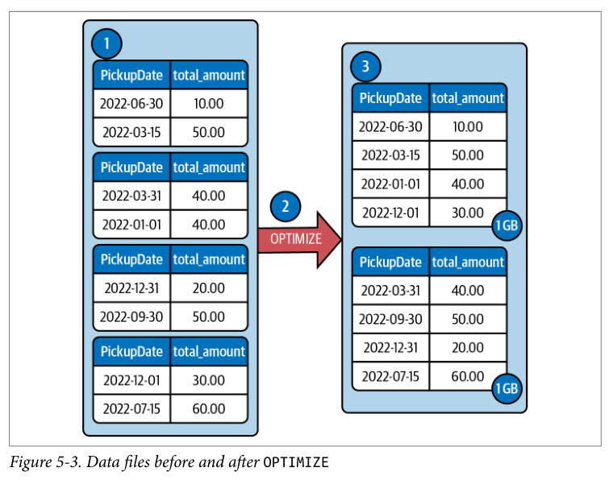
  * `OPTIMIZE` 명령은 파일이 어떻게 구성되어 있는지(데이터의 특정)를 고려하지 않으며 파일들을 통합하고 재구성하는 데에만 촛점을 맞추고 있습니다
  * `OPTIMIZE` 연산은 멱등(idempotence)하므로 여러번 수행하는 경우 두 번째 실행은 영향이 없습니다
  * 특히 특정 파티션에만 변경이 자주 발생한다면 조건을 주고 해당 파티션에만 최적화를 수행합니다
* `OPTIMIZE` 검토 사항
  * 많은 작은 파일들이 존재하는 파티션에 효과적이며
  * 이미 `coalesce` 된 큰파일 혹은 변경이 거의 없는 파티션에는 효과가 거의 없으며
  * 리소스가 상당히 많이 소요되는 연산이므로 분산 리소스 사용에 유의해서 스케줄링할 필요가 있다

### 5-5. ZORDER BY
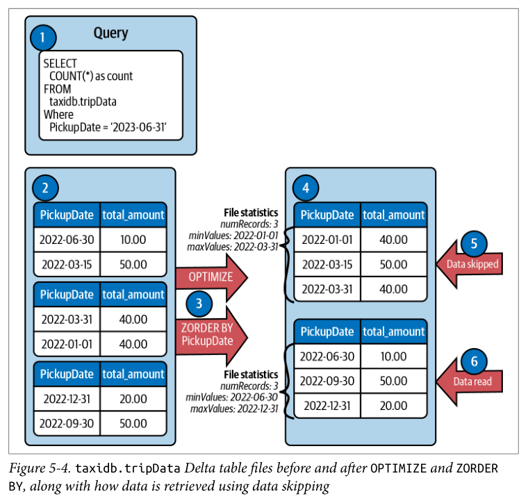
* 특정 컬럼의 값을 기준으로 정렬하고 일정 크기 이상의 파일로 저장하여 읽기 성능을 향상시키는 기법
  * 그림의 4번 항목은 `predicate-pushdown` 기법과 동일하게 파일 스킵이 가능
* `ZORDER BY` 검토 사항
  * 파티션 내에서만 동작하기 때문에, 파티셔닝 컬럼에 대해서는 적용할 수 없습니다
  * 특정 컬럼이 높은 카디낼러티를 가진다면 적용을 검토할 수 있습니다
  * `OPTIMIZE` 와 다르게 멱등하지는 않지만, 새로운 데이터가 없다면 수행되지 않습니다

> `Z-ordering` 동작은 병렬로 수행되며, 데이터의 분포가 미세하게 다른 경우 병합할 대상 파일을 다르게 선택할 수 있으며, 실행 순서 또한 변경될 수 있기 때문에 작업 시에 멱등성을 보장하지는 않습니다
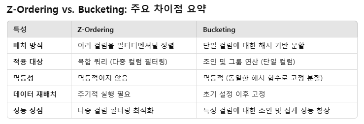

### 5-6. Liquid Clustering
* `Partitioning` - 특정 컬럼의 값을 물리적으로 고정된 데이터 레이아웃을 가지는 방식, 명시적이고 카디낼러티가 충분히 작다면 효과적인 방식
* `ZORDER BY` - 카티낼러티가 충분히 큰 경우 여러 컬럼에 대해서 파일 및 색인 최적화가 가능하지만, 멱등하게 동작하지 않는다는 점과 대상 커럼 정보를 기억해 두지 않는 경우 파일 레이아웃이 다르게 저장될 수 있다는 점이 단점이고, 데이터가 지속적으로 추가되는 경우에 수작업으로 수행되어야 한다는 단점
* `Liquid Clustering` - 아직 정식 배포된 기능은 아니지만, `Partitioning` 과 `ZORDER BY` 단점을 해결한 기법입니다
  * 높은 카디낼러티 컬럼에 대한 필터가 자주 발생하는 테이블
  * 데이터 분포에 있어 부분적인 편중이 있는 테이블
  * 튜닝 및 유지보수가 필요한 대용량 테이블
  * 동시쓰기가 필요한 테이블
  * 시간의 흐름에 따라 파티션 패턴이 변경되는 테이블

#### Enabling Liquid Clustering 
> 기존 테이블을 수정(ALTER)하여 생성할 수 없고 초기 생성시에만 지정할 수 있으며 `CLUTSER BY` 구문을 활용하여 생성할 수 있습니다

```sql
-- Create liquid clustering table
CREATE EXTERNAL TABLE taxidb.tripDataClustered CLUSTER BY (VendorId)
LOCATION '/datalake/book/chapter05/YellowTaxisLiquidClusteringDelta'
AS SELECT * FROM taxiDb.tripData LIMIT 1000;

-- Triggering clustering
OPTIMIZE taxidb.tripDataClustered;

-- Changing clustered columns
ALTER TABLE taxidb.tripDataClustered CLUSTER BY (VendorId, RateCodeId);

-- Describing clustered columns
DESCRIBE TABLE taxidb.tripDataClustered;

-- Removing clustered columns
ALTER TABLE taxidb.tripDataClustered CLUSTER BY NONE;
```

#### `Liquid Clustering` Constraints and Supported operations
* 자동 클러스터링 데이터 지원 연산
  * `INSERT INTO`
  * `CREATE TABLE AS SELECT (CTAS) statements`
  * `COPY INTO`
  * `Write appends such as spark.write.format("delta").mode("append")` 
* 다이나믹 데이터 레이아웃 특성
  * 트리거링 시에 모든 데이터가 아니라 적용이 필요한 부분만 적용된다
  * 쿼리 패턴이나, 조회 필요성에 따라서 변경이 가능하다
* 적용 가능한 환경 및 제약조건
  * Delta Lake 3.2 버전에서 소개 되었고 Spark 3.5.x 이상에서만 동작한다 (2024/10/28 현재)
  * 델타 테이블 조회시에 `Delta version 7`, `Reader version 3` 이상에서만 읽기가 동작한다
  * 테이블 생성시에 반드시 리퀴드 클러스터링 활성화가 되어야지 사용할 수 있다
  * 컬럼의 통계정보를 기반으로 하며, 해동 통계정보는 처음부터 32번째 컬럼까지만 지원한다
  * 구조화된 스트리밍 워크로드는 `clustering-on-write` 지원은 제공하지 않습니다
  * 새로운 데이터가 클러스터링 되도록 자주 `OPTIMIZE` 수행이 필요합니다

> 자동으로 클러스터링이 된다고 해서 증분에 대한 최적화가 이루어질 뿐이지 글로벌한 최적화는 보장하지 않기 떄문에 주기적으로 `OPTIMIZE` 해주어야만 최적의 성능을 보장할 수 있습니다

### 5-7. 결론
> 여러가지 저장, 조회 성능을 향상시키기 위한 기법 요약
* 파일 기반의 데이터 특성상 명시적으로 조회 I/O 축소를 위한 `Partitioning` 기법
* 하둡의 'Small file problem' 해결을 위해서 최적화 및 압축을 위한 `OPTIMIZE` 활용
* 파티셔닝 기법으로 해소하기 어려운 `High Cardinality Column` 문제 해결을 위한 `ZORDER BY` 기법
* `static data layout` 구조의 한계점을 가지고 있어서 `OPTIMIZE` 와 `ZORDER BY` 조합은 대상 컬럼을 메타데이터에 저장하지 않고 있어 별도로 관리되어야 하는 점과 그리고 명시적으로 `OPTIMIZE` 하지 않으면 적용되지 않는 문제를 해결하기 위해 `dynamic data layout` 지원의 `Liquid Clustering` 기법

### 5-8. Q&A
1. `overwriteSchema` 옵션?
   - `withColumn` 등으로 스키마가 변경된 경우에도 `overwriteSchema` 옵션으로 변경이 가능
   - 파티션 추가 이전과 이후 파티션 별 스키마가 달라지는지, 테이블 스키마는 어떤지 확인이 필요함
2. `dataChange` 옵션?
   - 일반적으로 업데이트가 필요한 동작 가운데, 데이터가 변경되지 않는 경우(최적화 등)는 false 설정
   - false 경우에는 히스토리 로그에 저장되지 않지만, 업데이트 발생시에는 작업데이터가 손상될 수 있습니다
   - 특히 대상 테이블이 스트리밍 소스로 사용되는 경우 의도하지 않은 변경이 데이터 사용자에 영향을 줍니다
3. `replaceWhere` 옵션?
   - 데이터를 읽을 때에는 `where` 절로 필터링하고, 저장 시에는 델타 옵션인 `replaceWhere` 절로 명시
4. 명시적으로 정해진 `optimize` 및 `vacuum` 시에 `dataChange` 옵션이 false 가 맞나?
   - 기본 설정이 false 이며 이 때에 데이터를 읽고 쓰는 데에는 이슈는 없는 게 맞다
   - 다만, 다수의 쓰기 동작이 있는 경우 다수의 트랜잭션이 발생할 수 있고 전체적인 지연과 장애가 발생할 수는 있다

### 5-9. Exercises
1. 파티션 없는 users (id, firstName, lastName) 테이블의 에서 (middleName) 컬럼을 추가한 상태에서 저장 시에 스키마는 어떻게 되는가?
```python
AnalysisException: A schema mismatch detected when writing to the Delta table (Table ID: 76246dde-b128-43df-8fca-605c2dbef282).
To enable schema migration using DataFrameWriter or DataStreamWriter, please set:
'.option("mergeSchema", "true")'.
For other operations, set the session configuration
spark.databricks.delta.schema.autoMerge.enabled to "true". See the documentation
specific to the operation for details.
```
2. 1번 저장 오류의 경우 `mergeSchema` 옵션을 주고 저장하면 어떻게 되는가?
> mergeSchema : 스키마가 추가되지만 기존 컬럼의 가장 마지막에 컬럼이 추가된다
3. `overwriteSchema` 옵션을 주고 저장하면 어떻게 되는가?
> overwriteSchema : 덮어쓰기 모드(overwrite)에서만 사용할 수 있으며 기존 데이터가 모두 사라짐에 주의해야 한다
4. 파티션이 존재하는 상태에서 테이블에 2일차 파티션에만 컬럼이 추가되는 경우?
> 어차피 델타 테이블의 경우 파티션 단위로 파일이 저장될 뿐, 특정 경로를 읽어내는 경우는 없으며, 스키마 또한 통합되어 관리되기 때문에 overwrite 혹은 merge 둘 중에 하나만 고민하면 된다
5. 데이터 변경이 존재하는 변경 시에 dataChange = false 주게 되는 경우?
> 최초 테이블 생성 시에 저장되는 히스토리 정보 확인 후, append 이후에 히스토리 내역을 보면 `islocationLevel` 이 `Serializable` 에서 `SnapshotIsolation` 으로 변경

#### Isolation Level using Delta Lake
> 결국 아래의 설정을 고려하여 `Where` 절과 `replaceWhere` 등의 구문을 활용하여 적절한 격리수준을 제공하는 것이 성능에 영향을 줄 수 있습니다

| 격리수준 | 동시성 | 일관성 | 성능 |
| --- | --- | --- | --- |
| Serializable | 수정 중인 데이터에 대한 접근을 완전히 차단 | 완전한 격리와 일관성을 보장 | 높은 동시성 환경에서 더 나은 성능을 제공 |
| SnapshotIsolation | 다른 트랜잭션이 읽고 쓸 수 있도록 허용 | 동시 수정으로 인해 불일치가 발생 | 트랜잭션 간의 상호 작용에 더 많은 유연성을 허용 |


## 6. 시간 여행
> 시간이 지남에 따라 데이터가 변경되고 그에 따른 조건이나 다양한 환경에 따라 요구사항이 바뀌는 경우가 많은데 이러한 다양한 상황에서 활용 가능한 '시간여행' 기능에 대해 소개합니다
* GDPR 과 같은 규제에 따른 데이터의 영구적인 삭제
* 실험 혹은 리포트를 위한 특정 시점의 데이터 조회
* 실수 혹은 오류에 의한 과거 시점으로의 데이터 롤백
* 시계열 분석이나 디버깅을 위한 다양한 정보 조회

### 델타 레이크 리텐션 관련 안전장치
1. 델타 레이크 엔진의 경우, 로그는 30일, 데이터는 최근 7일 이내의 로그 및 데이터는 삭제는 할 수 없다
1. 만약 7일 이내의 기간에 대한 로그 및 데이터 삭제를 위해서는 'spark.databricks.delta.retentionDurationCheck.enabled' 설정을 false 로 설정해야 한다
1. 해당 일자를 초과하는 기간에 대해서는 언제든지 변경이 가능하다
1. 생성 및 수정을 통한 `TBLPROPERTIES ('delta.logRetentionDuration'='interval 10 minutes')` 변경은 초 단위까지 가능하지만
1. 명령어 `VACUUM` 실행 시에는 `VACUUM tableName RETAIN 0 HOURS;` 와 같이 시간 단위로만 변경이 가능하다

### 데이터 리텐션의 특징
1. 기본적으로 데이터 파일은 `VACUUM` 명령이 실행되기 전까지는 어떠한 파일도 삭제되지 않으며, 삭제 대상 후보를 정의하기만 합니다
1. 최근 7일 이내의 데이터 삭제를 위해서는 `retentionDurationCheck.enabled` 값을 false 설정이 필요합니다
1. 테이블 DDL 명령을 통해서 `ALTER TABLE <table-naem> SET TBLPROPERTIES('delta.deletedFileRetentionDuration' = 'interval 30 seconds')` 와 같이 설정을 변경할 수 있습니다
1. 반드시 명시적으로 `VACUUM` 수행을 해야만 데이터 파일의 삭제가 이루어집니다

### 로그 리텐션의 특징
1. 기본적으로 로그 파일은 명시적으로 삭제하는 명령이 존재하지 않으며, 제약조건에 맞는 로그파일에 대해서 체크포인트 파일이 생성되는 시점에 조건에 맞는 로그 파일들을 자동으로 삭제합니다 (즉, 트랜잭션이 발생하지 않으면 영원히 로그파일은 삭제되지 않습니다)
1. 델타 테이블의 체크포인트 생성 기본 설정은 커밋 10회에 1번씩 체크포인팅이 되기 때문에 그 와중에 발생한 커밋에 대한 시간 여행이 불가능합니다 (0 ~ 9 까지 생성되고 11회차가 체크포인트와 해당 커밋이 같이 생성)
1. SQL 수준에서 `checkpont` 명령은 없으며, 별도의 프로그램을 통해 API 호출로만 체크포인트 생성이 가능합니다
1. 로그의 경우 해당 로그가 생성되는 시점에 `logRetentionDuration` 값에 따라서 로그가 삭제되며, 해당 정보는 `TBLPROPERTIES` 정보를 활용합니다
1. 로그삭제 기본설정이 30일이므로 변경이 필요한 경우 테이블 생성 혹은 이후에 명시적으로 변경해 주어야만 합니다 (스트리밍 애플리케이션의 경우 로그 파일이 상당히 많아질 수 있으며, 특히 하이브 테이블로 생성된 경우 조회 성능에 영향을 줄 수 있기 때문에 반드시 수정을 검토해야만 합니다)
1. 2024/10/30 현재 구현상 [MetadataCleanup.scala](https://github.com/delta-io/delta/blob/master/connectors/standalone/src/main/scala/io/delta/standalone/internal/MetadataCleanup.scala#L50) 현재시간을 기준으로 리텐션 시간을 뺀 시간에서 GMT 기준 0시 기준으로 일자로 이전일까지만 삭제 대상으로 지정합니다 (현재 체크포인트가 생성되는 시점에 로그 리텐션이 0시간 이라고 하더라도, 오늘 새벽 0시 이전의 로그만 삭제된다고 볼 수 있습니다)
1. 정리하면 로그 리텐션은 ***테이블 생성시에 특성에 맞도록 반드시 설계***해야 하고, ***삭제시점을 명시적으로 지정할 수 없***으며, 지속적인 변경이 발생하여 주기적으로 체크포인트가 생성된다는 가정 하에 ***한국시간 기준으로 오전 9시 경에 리텐션 이전의 로그 파일이 자동으로 삭제***됩니다

### 스트리밍 애플리케이션의 적절한 로그와 데이터 관리 정책
1. 스트리밍 애플리케이션의 경우 로그 생성량에 따라 조정해야 하지만, 1분 이내 여러 트랜잭션이 발생하는 경우 로그 리텐션 조정 검토가 필요함
1. 특히 델타 레이크 커넥터를 통한 하이브 서비스를 고려한다면, 로그의 수에 따른 성능 저하가 예상되므로 생성 시점에 1일~1시간 이하로 리텐션 적용을 검토할 것
   - 1시간으로 지정하면 오전 9시 경에 9시 이전 로그가 모두 삭제된다고 보면 되고, 그 이후로 24시간 누적된다
1. 데이터 리텐션의 경우는 로그 리텐션 보다 길 수 없으므로 동일하게 조정하는 것이 적절합니다
   - 일반적으로 스트리밍의 경우 팩트성 데이터가 많다보니 삭제에 대한 설정은 사실 큰 의미는 없지만 동일하게 유지하는 것이 관리 차원에서 유리합니다
1. 외에도 스트리밍 처리는 자동 압축이나, 최적화 및 컴팩션 등의 배치 처리를 별도 스케줄로 운영해야 합니다

### 로그/데이터 리텐션 강제 실행이 가능한가?
* 데이터는 가능하지만, 로그는 어렵다


### 6-1. Delta Lake Time Travel
* 델타 레이크 테이블은 모든 오퍼레이션에 따른 이력을 저장하고 있으며 이는 `DESCRIBE HISTORY <table-name>` 명령으로 확인이 가능하며 특정 버전 혹은 시점의 데이터 조회 `<table-name> VERSION AS OF <version>` 및 복구 `RESTORE <table-name> TO TIMESTAMP AS OF <version>`가 가능합니다

#### Restoring a Table
```sql
--describe the table history
DESCRIBE HISTORY taxidb.tripData;

--restore table to previous version
RESTORE TABLE taxidb.tripData TO VERSION AS OF 0;

--restore table to a specific timestamp
RESTORE TABLE taxidb.tripData TO TIMESTAMP AS OF '2023-01-01 00:00:00';

--restore table to the state it was in an hour ago
RESTORE TABLE taxidb.tripData
TO TIMESTAMP AS OF current_timestamp() - INTERVAL '1' HOUR;
```
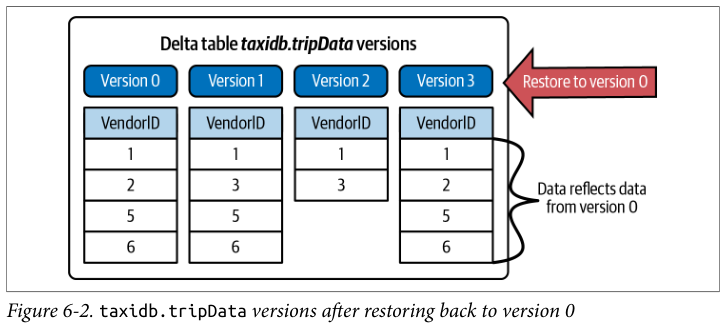
```python
from delta.tables import *

--restore table to a specific timestamp using PySpark
deltaTable = DeltaTable.forName(spark, "taxidb.tripData")
deltaTable.restoreToTimestamp("2023-01-01")
```
> 트랜잭션 로그를 통해 어느 시점에 어떤 데이터는 읽어도 되는지, 읽으면 안 되는 지를 알 수 있듯이, 리스토어 명령도 유사하게 트랜잭션 로그를 통해 동작합니다
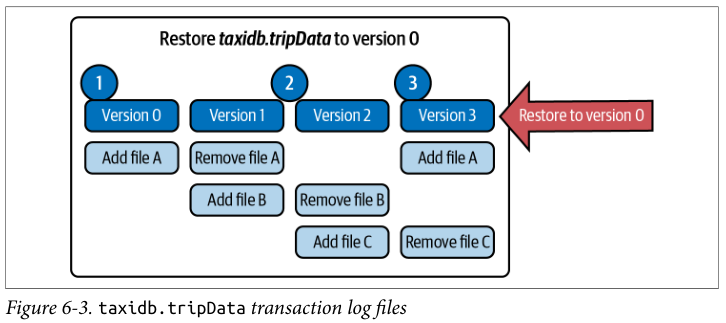

#### Restore 고려 사항
> 리스토어 작업은 당연하게도 데이터 변경이 발생하는 오퍼레이션(dataChange=True)이기 때문에, 다운 스트림 작업이 존재하는 경우 의도하지 않은 사이드 이펙트가 발생할 수 있습니다. 즉, 데이터를 읽어가고 있는 스트리밍 작업이 있는 경우 업스트림 소스에서 리스토어가 발생하면 기존에 존재하는 데이터가 다시 추가(add, dataChange=True)되기 때문에 중복 혹은 일관성 문제가 발생할 수 있습니다

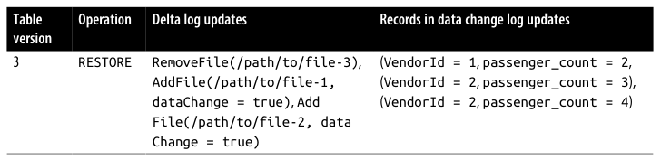


#### Querying on Older Version of a Table

```sql
--describe the table history
DESCRIBE HISTORY taxidb.tripData;

--count records where VendorId = 1 using version number
SELECT COUNT(*) AS count FROM taxidb.tripData VERSION AS OF 2 WHERE VendorId = 1;

--count records where VendorId = 1 using operation timestamp
SELECT COUNT(*) AS count FROM taxidb.tripData VERSION AS OF ’2023-01-01 00:00:00’ WHERE VendorId = 1;

--count records where VendorId = 1 using operation timestamp and using @ syntax timestamp must be in yyyyMMddHHmmssSSS format
SELECT COUNT(*) AS count FROM taxidb.YellowTaxi@20230101000000000 WHERE VendorId = 1;

--count records where VendorId = 1 using version number and using @ syntax
SELECT COUNT(*) AS count FROM taxidb.tripData@v2 WHERE VendorId = 1;

--count number of new passengers from 7 days ago
SELECT sum(passenger_count) - (
  SELECT sum(passenger_count)
) FROM taxidb.tripData TIMESTAMP AS OF date_sub(current_date(), 7)
FROM taxidb.tripData
```
> 위의 마지막 예제인 시계열 분석 쿼리는 가능성을 보여준 것이며, 실제 CDF(Change Data Feed)기법을 통해 보다 효과적인 시계열 분석이 가능합니다


### 6-2. Data Retention
> 델타 테이블의 데이터 파일은 `VACUUM` 명령이 명시적으로 수행되지 않으면 자동으로 삭제되지 않으나, 아카이브 로그는 명시적으로 삭제할 수 없으며 정의된 기준에 의해 자동으로 삭제됩니다. 기본 설정은 30일간의 커밋 로그 이력 정보를 유지합니다

#### File Retention
```sql
--describe table history
DESCRIBE HISTORY taxidb.tripData

--set log retention to 365 days
ALTER TABLE taxidb.tripData
  SET TBLPROPERTIES(delta.logRetentionDuration = "interval 365 days");

--set data file retention to 365 days
ALTER TABLE taxidb.tripData
  SET TBLPROPERTIES(delta.deletedFileRetentionDuration = "interval 365 days");

--show the table properties to confirm data and log file retention
SHOW TBLPROPERTIES taxidb.tripData;
```

#### Data Archiving
> 정기적으로 아카이빙이 필요한 경우 지속적으로 늘어나지 않도록 명시적으로 `REPLACE` 합니다

```sql
--archive table by creating or replace
CREATE OR REPLACE TABLE archive.tripData USING DELTA AS
SELECT * FROM taxidb.tripData
```

### 6-3. VACUUM
> 리텐션 설정은 삭제대상 파일의 임계치를 지정하는 것이며 명시적인 삭제는 `VACUUM` 명령이 수행될 때이다
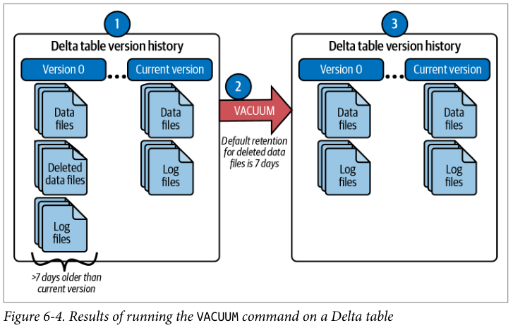

> 주기적으로 모든 델타 테이블에 대해서 `VACUUM` 명령을 수행하는 것이 추천되며 가능한 자주 실행해줄 수 있다면 해당 작업 시에 수행되는 트랜잭션의 범위가 줄어들어 리소스 사용이나, 격리 및 모니터링 등에 용이합니다
```sql
--view the previous vacuum commit(s)
DESCRIBE HISTORY taxidb.tripData

--dry run to get the list of files to be deleted
VACUUM taxidb.tripData DRY RUN
    
--vacuum files not required by versions older than the default retention period
VACUUM taxidb.tripData;

--vacuum files in path-based table
VACUUM './chapter06/YellowTaxisDelta/';
VACUUM delta.`./chapter06/YellowTaxisDelta/`;

--vacuum files not required by versions more than 100 hours old
VACUUM delta.`./chapter06/YellowTaxisDelta/` RETAIN 100 HOURS;
```

#### `VACUUM` 사용시 유의사항
* 기본 설정 7일 이해의 데이터 리텐션 인터벌은 추천하지 않습니다
* `retentionDurationCheck.enabled` 의 false 설정은 아주 위험하며, 명확히 알고있는 수준에서만 사용해야 합니다
* 델타 레이크 테이블 디렉토리 내에는 관리되지 않는 모든 파일은 삭제되므로 유의해야 합니다. 단, `underscore (_)` 로 시작하는 디렉토리는 예외이므로 스트리밍 애플리케이션의 체크포인트 경로는 `_checkpoints` 와 같이 사용하면 안전합니다
* `VACUUM` 작업은 데이터의 크기에 따라 리소스와 시간이 많이 소요됩니다. 또한 `OPTIMIZE` 와 병행하여 테이블이 항상 최적의 상태를 유지하도록 관리하는 것을 추천합니다


### 6-4. Changing Data Feed
> 시계열 분석을 위해 전체 테이블을 시간여행을 통해 분석할 수도 있지만, 좀 더 우아하게 모든 트랜잭션을 트래킹 할 수 있는 기법이 Change Data Feed(CDF) 입니다. 델타 테이블에서 "change events" 를 활성화 했다면 스트리밍 애플리케이션 등을 통해서 대상 테이블에서 발생하는 모든 트랜잭션을 인지할 수 있고, 지정한 로우의 CRUD 에 대한 인지가 가능합니다

* ETL operations : 대용량의 fact 성 업스트림에서 극히 일부의 데이터만 처리하고 싶을 때
* Transmit changes for downstream consumers : 스파크 스트리밍, 카프카 컨슈머 등의 다양한 스트림 컨슈머에 준 실시간 분석용 스트리밍 리포트를 생성하고 싶을 떄
* Audit trail table : 모든 스트리밍 로우에 대한 감사가 필요할 때

#### Enabling the CDF
> 아래의 명령이 수행된 직후 부터 CDF 가 활성화되며 `_change_data` 경로 아래에 레코드가 저장되는데, `updates` 와 `deletes` 의 변경사항만이 저장되며 `inserts` 정보는 `_delta_log` 의 트랜잭션 로그를 확인하는 것이 더 효과적입니다
```sql
-- activate all new tables by setting this Spark configuration property
set spark.databricks.delta.properties.defaults.enableChangeDataFeed = true

--create new table with change data feed
CREATE TABLE IF NOT EXISTS taxidb.tripAggregates 
(VendorId INT, PassengerCount INT, FareAmount INT)
  TBLPROPERTIES (delta.enableChangeDataFeed = true);

--alter existing table to enable change data feed
ALTER TABLE myDeltaTable SET TBLPROPERTIES (delta.enableChangeDataFeed = true);
```
* `_change_data` 경로의 모든 데이터는 데이터 파일의 리텐션과 동일하게 적용됩니다

#### Viewing the CDF Using SQL
```sql
-- view the row-level changes of a table
SELECT *
FROM table_changes('taxidb.tripAggregates', 1, 4)
ORDER BY _commit_timestamp

-- changes over time
SELECT *
FROM table_changes('taxidb.tripAggregates', 1, 4)
WHERE VendorId = 1 AND _change_type = 'update_postimage'
ORDER BY _commit_timestamp

-- inserts
SELECT *
FROM table_changes('taxidb.tripAggregates', '2023-01-01')
WHERE VendorId = 1 AND _change_type = 'insert'
ORDER BY _commit_timestamp
```

#### Using DataFrame APIs
```python
# view CDF table changes using versions
spark.read.format("delta") \
.option("readChangeFeed", "true") \
.option("startingVersion", 1) \
.option("endingVersion", 4) \
.table("taxidb.tripAggregates")

# view CDF table changes using timestamps
spark.read.format("delta")\
.option("readChangeFeed", "true")\
.option("startingTimestamp", "2023-01-01 00:00:00")\
.option("endingTimestamp", "2023-01-31 00:00:00")\
.table("taxidb.tripAggregates")
```

#### CDF 의 특징 및 유의점
* 데이터 파일과 마찬가지의 리텐션을 가지므로, 파일 리텐션 정책에 근거해서 사용해야 한다
* 실제 원본 데이터가 아니라 변경된 데이터의 일부만 저장되어 오버헤드는 상대적으로 아주 작다
* CDF 활성화되기 이전의 변환에 대해서는 저장되지 않는다
* 한번 활성화 했다면 Delta Lake 1.2.1 이하의 버전과는 호환되지 않습니다

### 6-5. Conclusion
> 델타 레이크의 시간여행 기능이 제공하는 가능성을 이해하고 활용 사례를 만들어 볼 수 있습니다

#### 활용 사례
* Time Travel
  * 하나의 테이블을 활용하여 과거 특정 시점과 비교 분석 및 조인이 가능합니다
* Data Retention & VACUUM
  * 새로운 기능을 제공하기 보다는, 이러한 테이블 운영 관점에서 반드시 검토되어야 할 운영관리 기능
* Change Data Feed
  * 실시간 데이터 스트리밍을 통해 기존 스트리밍 애플리케이션을 대체할 수 있는기 검토


### 6-6. Q&A
1. 항상 모든 트랜잭션에 대해 시간 여행이 안되는 것 같은데, 체크포인트를 임의로 생성할 수 있나요?
   * SQL 은 불가능하고, API 통해서만 가능합니다
2. 문서에서는 로그의 양과 성능에 영향이 없다고 하는데 스트리밍 델타 테이블의 경우 하이브 조회에 성능이 너무 느린데 왜 그런가요?
   * 스파크의 경우 세션 생성시에 모든 메타를 로딩 후, 메모리에서 관리하기 때문에 메타 관리 이슈가 없으나, 하이브 테이블로 로딩해서 사용 시에는 매 호출시 마다 대상 트랜잭션 로그를 읽을 필요가 있기 때문에 상당히 느려질 수 있습니다
   * 특히 스트리밍 테이블의 경우 트랜잭션의 수에 따라 트랜잭션 로그의 리텐션을 조정할 필요가 있습니다
3. GDPR 과 같은 이유로 특정 개인정보를 가진 데이터를 저장소에서 완전히 삭제가 가능한가요?
  * 특정 데이터를 가진 레코드를 삭제 혹은 특정 컬럼을 삭제할 수 있습니다
  * 다만, `VACUUM tableName RETAIN 0 HOURS;` 명령은 과거의 데이터에 더 이상 접근이 불가능하게 됩니다
4. 같은 이유로 레코드 삭제가 아니라 특정 컬럼만 삭제하는 것이 가능한가요?
  * 컬럼을 드랍하는 방식이 아니라 제거한 데이터프레임을 기존 테이블에 덮어쓰는 방식으로 해야합니다
  * 이 또한 `VACUUM` 명령을 통해서 과거 파일을 모두 삭제하면, 더 이상 접근이 불가능합니다
5. `VACUUM` 실행 시에도 `RETAIN 100 HOURS` 적용시에, 원 테이블 설정과 런타임 시의 설정 중에 어떤 것 기준으로 적용이 되는가?
  * 테이블 설정보다 높은 값이 아닌 경우 오류를 반환하게 됩니다
  * `spark.databricks.delta.retentionDurationCheck.enabled = false` 설정 시에는 지정이 가능하며 반드시 `RETAIN` 설정 값을 지정해야 하는데, 조회되는 가장 긴 기간 혹은 업데이트 가능성이 있는 시간 보다 긴 시간을 지정해야 데이터 유실을 막을 수 있습니다
6. 아래와 같이 형식은 동작하지 않는가?
```sql
SELECT COUNT(*) AS count FROM taxidb.YellowTaxi@`2023-01-01 00:00:00` WHERE VendorId = 1;
```
7. 왜 CDF 형식은 insert 와 Delete, Update 를 달리 저장하는 걸까? _delta_log 에 모든 CRUD 가 다 저장되지 않는가?
  * 어떤 값이 어디서 어떻게 변화했는지에 대한 정보를 굳이 남기는 것은 부하가 클 뿐만 아니라, 굳이 가지고 있지 않아도 되는 정보이므로 현재 시점의 스냅샷만 저장하는 것이 델타의 기본 동작이라고 할 수 있다
  * 삭제, 변경 전후 정보를 모두 유지하는 것으로써 완전한 아카이빙 로그로써 동작할 수 있게된다


## 7. Schema Handling
> 델타 레이크는 전통적인 RDB 와 같은 Schema enforcement 기법과 Schema evolution 모두 지원한다


### 7-9. Q&A
* 하이브 테이블로 사용하는 경우 스키마 변경에 대한 지원은 델타 레이크 기준으로 사용되는 걸까?


## 8. Operations on Streaming Data

* 트리거 설정이 없다면 이벤트 발생 직후 실행되는가?
* 델타 스트림 소스는 어떤 옵션들이 있는가?
* 오프셋 내에는 실행 계획을 설명하는 파일이므로, 처음에는 새로운 데이터가 없으므로 저장소 버전도 0, 실행 인덱스도 0 으로 설정되지만 데이터가 업데이트된 이후에 소스 버전이 1이므로 다음 버전이 2가 되는가?
* ignore 관련 옵션을 주게되면 타깃 테이블은 어떻게 보이는지?
* 스트리밍 앱에서 업데이트 발생시에 타깃 테이블에도 저장은 된다는 말인가? 어떻게 동작하는지 실습이 필요하다..
* `offsets/0` 기 존재하는 델타 테이블에 대한 첫 번째 스트리밍 쿼리 실행 결과
  * "sourceVersion": 1 -> 원본 소스의 버전으로 초기값은 1
  * "reservoirId": "6c25c8cd-88c1-4b74-9c96-a61c1727c3a2" -> 소스 저장소의 유일한 값
  * "reservoirVersion": 0 -> 현재 델타 테이블 저장소에 대한 트랜잭션의 버전이며 초기값은 0
  * "index": 0 -> 델타 테이블에 대한 스트리밍 쿼리를 수행하기 위한 인덱스 혹은 오프셋을 말한다
  * "isStartingVersion": true -> 이번 쿼리가 초기 버전으로부터 데이터를 읽어오고 있음을 의미한다
* `offsets/1` 스트리밍 앱이 실행되는 과정에서 10건의 데이터가 들어왔고 이를 처리하기 위한 계획 정보
  * "sourceVersion": 1 -> 소스의 구조나 설정이 변경되지 않았으므로 1로 유지
  * "reservoirId": "6c25c8cd-88c1-4b74-9c96-a61c1727c3a2" -> 기존 값과 동일하게 유지
  * "reservoirVersion": 2 -> 다음 실행이 완료되었을 때의 트랜잭션 버전 (현재 트랜잭션은 1)
  * "index": -1 -> 이후 처리해야 할 데이터가 남아있지 않기 떄문에 다음 트랜잭션 번호가 없음을 -1로 표현
  * "isStartingVersion": false -> 이번 쿼리가 초기 실행이 아니라 추가 데이터의 트랜잭션임을 의미한다


## 9. Delta Sharing


## 10. Building a Lakehouse on Delta Lake


## 11. Q&A

### 9-1. 델타를 통해서 파일을 저장하는 경우 굳이 파티셔닝 하지 않아도 될 것 처럼 보이는데, 언제 파티셔닝 하면 좋은가?

### 9-2. 순수하게 델타를 통한 색인, 디렉토리 파티셔닝을 통한 저장 그리고 리퀴드 클러스터링 각각 어떤 경우에 사용하면 좋은가?

### 9-3. [Unity Catalog](https://www.databricks.com/blog/open-sourcing-unity-catalog) 가 권한관리, 거버넌스 등을 한다고 아는데 구체적으로 어떤 컴포넌트로 구성되고 어떻게 동작하는가?

### 9-4. Data Warehouse 와 Data Lake-house 의 차이점?

### 9-5. 스파크의 장점, 한계점 그리고 어떤 경우에 사용하면 가장 효과적인지 말할 수 있는가?

### 9-6. 데이터브릭스 런타임에서 제공하는 최적화 (Photon 포함)와 오픈소스 스파크의 차이점과 장단점?

### 9-7. 데이터브릭스 SQL 이 뭔가?

### 9-8. 델타를 통해 스트리밍 데이터 저장 시에 아카이빙 로그에 따른 하이브 조회 시에 부하가 커지는데?
> 하이브 통한 조회에 대한 이슈는 해결이 힘들 것 같고, 데이터브릭스 런타임 연동한 테스트를 해보면 좋겠다


## 10. Future Works

### 10-1. 내가 알고 있는 사실 혹은 아키텍처의 장단점을 어떻게 하면 잘 설명할 수 있고, 강점을 부각시킬 수 있는지 생각하라

### 10-2. 생성형 AI 통한 코드 추천, 코드 수정 가이드 및 오류 원인 요약문 등의 서비스 확장 검토

### 10-3. AWS 의 Zero ETL 에 대한 이해와 향후 방향에 대한 검토

### 10-4. 델타레이크의 기술적인 이해와 1시간, 30분 그리고 5분 만에 설명할 수 있는 정리

### 10-5. 델타레이크, 유니티 카탈로그 및 스파크를 통한 데이터 팀의 향후 로드맵 

### 10-6. 스파크 새로운 실행 엔진 Photon 내부 구조 및 특징 이해

### 10-7. 검색(Search)와 탐색(Discovery)의 차이점의 이해

### 10-8. 다양한 실용 사례 확인 및 적용 해볼 것
* 대용량 데이터 병합(Merge) 시에 델타 레이크 `Deletion Vector` 활용하면 효과적이라고 함
* 데이터브릭스 런타임에는 `ZORDER` 개선된 버전이 적용되어 더 좋은 성능을 낸다고 함
* 델타 레이크 4.0 버전에 적용되는 `Json Variant Type` 지원을 통해 큰 성능향상을 기대할 수 있다고 함
* 리퀴드 클러스터링 통한 저장 방식에 대한 이해 및 실용 사례 참고

### 10-9. 잦은 변경이 발생하는 델타 테이블의 경우 어떻게 관리되어야 하는가?
* 매일 잦은 변경이 발생하는 것이 예상되는 경우는 매일 최적화를 하면 된다
* 가끔 의도하지 않게 타인에 의해 변경되는 경우는 해당 테이블의 메타정보가 모니터링 되어야 하지 않을까?

### 10-10. 텔타 테이블을 어떻게 관리하는 것이 가장 효과적인가?
* 컴팩션, 옵티마이즈 등의 작업은 쓰기 작업이므로 아무리 Append 되더라도 멀티 Writer 환경은 회피할 수 있어야 하는데, 이를 어떻게 우아하게 운영할 수 있도록 구현하면 좋을까?
* 주기적으로 조회되는 쿼리를 분석하여 어떤 컬럼을 기준으로 `Z-Ordering` 할 지를 추천하는 방안
* `Liquid Clustering` 전환과 호환이 안 된다고 하니 ... 확인 후 라이브 적용을 결정하는 것도 검토