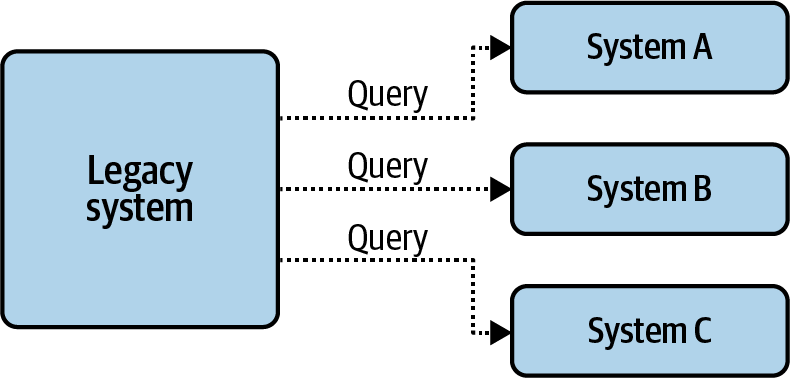
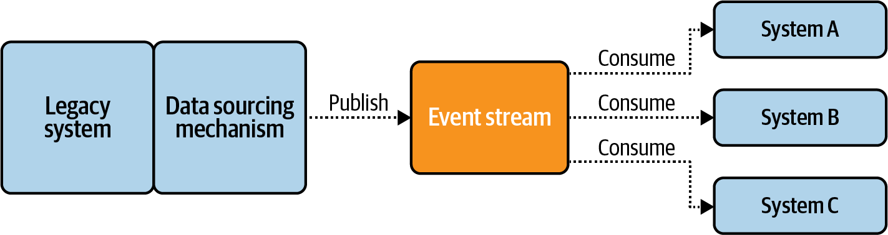
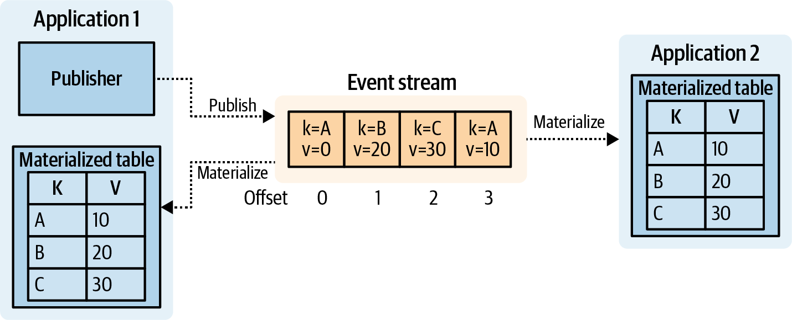

# Building Event-driven Microservices
> [이벤트 기반 마이크로서비스 구축](https://www.yes24.com/Product/Goods/99423020)

### Chapter 3. 통신 및 데이터 규약

#### p78 이벤트 포맷 선택
* Avro, ProtocolBuffer 같은 통제 가능한 Schema Evolution 지원이 가능한 명시적인 포맷을 추천하며, 텍스트 혹은 JSON 같은 포맷은 지양

#### p79 이벤트 설계
* 스트림 당 이벤트 정의는 하나만 사용 - 스키마 변경을 지양할 수 있도록 설계하라
* 가장 좁은 범위의 데이터 타입 사용 - 상수값이나 숫자 대신 enum 활용이 가능하다
* 이벤트는 하나의 목적만 갖도록 - 흔한 안티패턴 중에 하나이며, 비즈니스의 의미가 달라서 변화도 달라진다
  - 다만, 하나의 논리적인 테이블의 형태이고 다른 형태로 소비되는 것이라면 하나의 토픽도 적절하지 않을까?
  - 토픽이 달라지면 컨슈머도 따로 개발해야 하고 타입 별로 계속 늘어나게 되는데 결국 운영 유지보수 비용이 커질 수도 있다

> 프로그래밍 설계와 유사하게 향후 비즈니스의 변경 가능성이 큰지 여부에 따라 토픽으로 구분할 지, 스키마로 정의할 지 결정하면 좋겠다
> 변경될 가능성이 작고, 비즈니스가 단순한 적재(Stage) 토픽은 하나의 스트림에 다수의 스키마가 들어가는 것도 허용할 수도 있으나,
> 개별 스키마에 따라 비즈니스가 달라지고 향후 확장 가능성이 큰 저장(Store) 데이터의 경우에는 명시적으로 다른 토픽으로 관리하는 것이 좋겠다

### Chapter 4. 기존 시스템에 이벤트 기반 아키텍처 통합

#### p90 데이터 해방이란?
> 시스템 간의 직접적인 의존성을 해소하기 위해 이벤트 기반 아키텍처로의 마이그레이션 전략 중 하나

> 소스와 싱크를 이벤트 스트림으로 연결하는 플로우를 구성하여 디커플링하는 것을 말한다

> 데이터베이스와 같은 레거시 시스템으로 구현된 서비스는 이러한 과정이 복잡하고 불가능할 수도 있으며, [Debezium](https://medium.com/swlh/data-liberation-pattern-using-debezium-engine-4fd32b92d826) 같은 도구를 통해 동기화 하는 것도 방법일 수 있습니다

#### p94 데이터 해방 패턴
> 데이터를 해방한다는 의미는 결국 새로운 단일 진실 공급원을 만들겠다는 의도입니다.
> 어떠한 패턴이든 소스의 최근 업데이트 시간(`updated_at`)을 알 수 있어야 타임스탬프 순서대로 처리가 가능합니다

* 쿼리 기반
  * 데이터 저장소 쿼리 결과를 이벤트 스트림에 흘려보내는 방식
* 로그 기반
  * 저장소에 내장된 CDC 로그 혹은 아카이빙 로그 기능을 활용하여 전달하는 방식
* 테이블 기반
  * 테이블의 로우 단위로 아웃박스 테이블에 발행되는 방식
  * 데이터베이스 복제 혹은 트리거와 유사한 방식으로 보임

#### p95 데이터 해방 프레임워크
> 손쉽게 스트리밍 파이프라인 구성을 위해 도구 혹은 프레임워크를 도입할 수 있지만, 데이터 모델 노출이나 결합도(의존성)가 증가하는 안티패턴을 
> 조장할 우려가 있다는 점에 주의해서 사용해야만 한다

##### 도구 및 프레임워크
* [Kafka Connect](https://docs.confluent.io/platform/current/connect/index.html) : 카프카에서 지원하는 스트리밍 파이프라인 도구, 라이브러리
* [Apache Gobblin](https://gobblin.apache.org/) 스트리밍 배치 작업의 통합을 지원하는 프레임워크
* [Apache Nifi](https://nifi.apache.org/) 분산 데이터 처리 및 파이프라인 구성을 제공하는 UI 기반 데이터 관리 시스템

##### 쿼리로 데이터 해방
* 스냅샷 수집방식과 유사하게 벌크, 증분 혹은 커스텀 쿼리 등의 방식을 취하여 유연한 질의가 가능함
* 다만, 벌크를 제외한 나머지는 timestamp 컬럼이 필요하고, delete 에 취약하며, 대용량 데이터 처리 시에 리소스가 많이 소모되는 단점이 있다

### 키워드
* 경계 컨텍스트 : 
* 단일 진실 공급원 :
* 