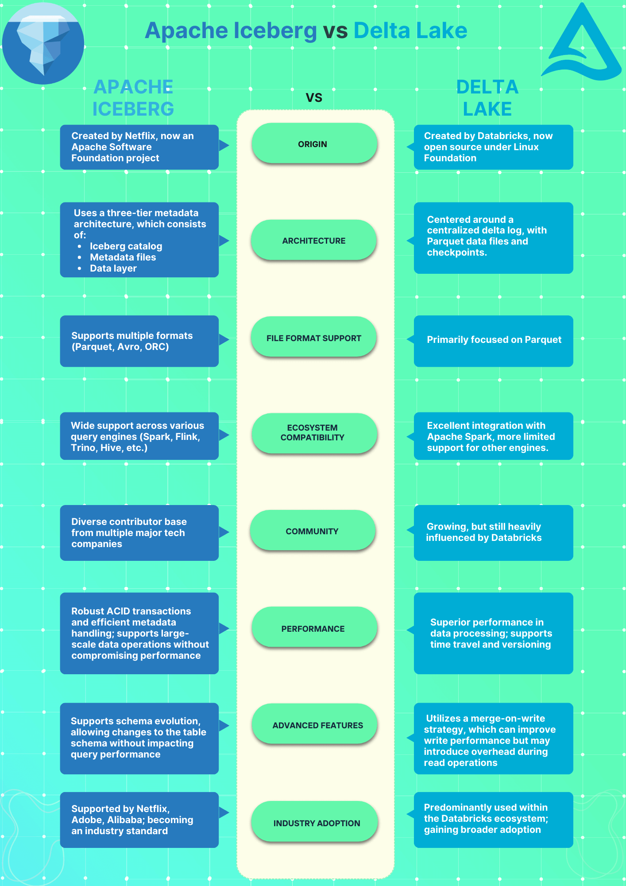
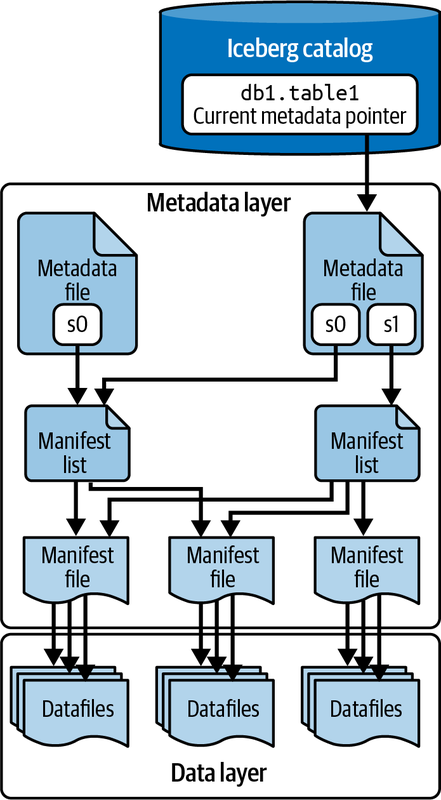

# Iceberg Quickstart
> 2025.07.02 학습시작

## 1. Apache Iceberg 구조 이해
* 계획 : [2025-Q3-Executive-Management](https://www.notion.so/psyoblade/2025-Q3-Executive-Management-223f2b5c7bc480d58de3dc58b5be9463)
* 기한 : 7/1 (화) ~ 7/31 (목)
* 목표 : Delta vs Iceberg 구조 비교 - Spark–Iceberg integration 이해
* 과제 : Iceberg 개념 정리 노트 (Presentation)

### 1.1 [Apache Iceberg at Wikipedia](https://en.wikipedia.org/wiki/Apache_Iceberg)
* 넷플릭스에서는 아파치 하이브 기반의 다양한 인프라 구조를 가졌는데, 하둡 파일 시스템의 한계로 원자성과 안전한 변경을 보장하기 어려웠고 이를 극복하기 위해서 Ryan Blue and Dan Weeks 가 2017 오픈소스로 Iceberg 개발을 시작
* 아이스버그는 테이블 메타데이터를 데이터 저장소에 추상화하여 동작하며, 스냅샷, 스키마 정보, 파티션 레이아웃 및 데이터 파일 위치를 추적하는 메타데이터 파일 관리를 통해 효율적이고 원자적인 테이블 작업을 지원
* 열기반의 저장구조를 가진 아파치 파케이 파일형식을 사용하여 저장
* 테이블 내용을 추적하기 위해 다단계 메타데이터 계층 구조를 사용하는데, 맨 위에 있는 테이블 메타데이터 파일(종종 metadata.json)은 스키마, 파티션 사양, 스냅샷 목록, 현재 "루트" 스냅샷에 대한 포인터와 같은 테이블 수준 정보를 저장하고, 각 스냅샷은 테이블에 대한 일관된 뷰를 나타내며 해당 스냅샷에 대한 모든 매니페스트 파일을 열거하는 매니페스트 목록(Avro 파일)과 연결됩니다
* 매니페스트 파일은 행 수, 파티션 값, 최소값 및 최대값과 같은 열 통계를 포함하여 각 파일에 대한 메타데이터와 함께 데이터 파일 세트(예: Parquet 파일)를 나열하는 인덱스이며 Avro 포맷으로 저장관리 됩니다

### 1.2 [Apache Iceberg vs Delta Lake: A Practical Guide to Data Lakehouse Architecture](https://atlan.com/know/iceberg/apache-iceberg-vs-delta-lake/?utm_source=chatgpt.com)

* 데이터 저장분야의 패러다임이 진화하고 있으며, 기존의 데이터 레이크의 유연성과 데이터 웨어하우스의 안정성을 결합하고 이를 데이터 레이크하우스라고 말하며 이러한 변화를 가능하게 하는 핵심은 바로 테이블 형식에 있습니다. 그리고 이러한 테이블 형식의 표준을 아이스버그와 델타 레이크라는 두 표준이 흐름을 선도하고 있습니다

#### 1.2.1 Apache Iceberg 와 Delta Lake 유사점?
* ACID Transaction : ACID (Atomicity, Consistency, Isolation, and Durability) 트랜잭션을 보장하는 오퍼레이션 제공
* Schema Evolution : 새로운 컬럼의 추가 변경 삭제 시에도 기존 스키마와의 호환성을 보장
* Time Travel : 디버깅, 분석 및 다양한 활용이 가능한 특정 스냅샷 시점으로의 시간 여행을 지원
* Metadata Management : 페타 스케일 규모 이상의 데이터를 다루는 경우에도 확장성, 안정성 및 성능을 보장하는 메타데이터 관리 기능
* Partition Evolution : 물리적인 경로의 변경 없이 파티션을 다시 구성이 가능해 데이터 액세스 패턴의 변경에 따라 최적화된 상태를 유지

#### 1.2.2 Apache Iceberg 와 Delta Lake 차이점?
* Schema evolution and data type support : Iceberg 가 복잡한 스키마 유형의 변경에 조금 더 유연하다
* Partitioning and performance optimization : Iceberg 는 Hive 와 Delta 는 Spark 와 더 좋은 성능과 호환성을 제공한다
* Metadata management and file organization : 중소규모의 경우 델타레이크가 빠르고 간단하지만, 대규모 데이터는 아이스버그가 유리한 구조
* Query engine compatibility : 아이스버그는 다양한 생태계에서 호환성을 보장하나, 델타는 스파크에 최적화되어 있음
* Scalability and resource management : 대용량 데이터 처리와 확장성 관점에서 아이스버그 엔진이 효과적임

#### 1.2.3 구현 팁: 염두에 두어야 할 3가지 모범 사례
1. Match your table format to your data setup
   * 스파크와 주로 작업을 한다면 델타, 하이브 트리노와 같은 검색엔진이라면 아이스버그
   * 업데이트가 자주발생하지 않은 중소규모의 데이터 저장 관리 테이블은 델타 레이크
   * 일 단위 테라 규모이상의 데이터의 저장 및 변경이 예상된다면 아이스버그
2. Streamline integration with your existing data ecosystems : 레거시 도구(UI 포함) 호환성 검토, 강력한 백업 및 재해 복구 계획
3. Plan for scale, while still prioritizing optimal performance
   * 트랜잭션 로그 및 메타데이터 크기를 모니터링 대시보드 및 알림 등록
   * 데이터 쿼리 방식을 기반으로 자주사용하는 필드를 기준으로 파티션 전략 설계
   * 데이터 관리 및 보존 정책을 구성하고 자동화된 스냅샷 관리 및 삭제 전략 설계
   * 사용량이 적은 시간에 오래된 스냅샷, 만료된 매니페스트 데이터 및 메타데이터 정리를 처리하도록 스케쥴

#### 1.2.4 Apache Iceberg 와 Delta Lake 선택을 위한 체크리스트

* Apache Iceberg: **다양한 쿼리 엔진을 갖춘 클라우드 기반 아키텍처**에 가장 적합
   * *다양한 쿼리 엔진(Hive, Trino 등)* 지원
   * *엄청난 양(수 TB 이상)의 데이터 세트*로 작업
   * 유연한 스키마 진화가 필요
   * 공급업체에 구애받지 않는 솔루션
   * 다양한 플랫폼에서 수평적으로 확장할 계획
* Delta Lake: **긴밀한 통합이 필요한 Spark 중심 환경**에 가장 적합
   * 주로 *데이터 처리에 Spark* 엔진을 사용
   * 더 *간단한 설정과 관리*가 필요합니다
   * *중소 규모(수 TB 이하) 데이터 세트*를 보유합니다.
   * *스트리밍 작업에 대한 강력한 지원*이 필요합니다.


### 1.3 [Apache Iceberg vs Delta Lake (I): Metadata Management & Indexing (2025)](https://www.chaosgenius.io/blog/iceberg-vs-delta-lake-metadata-indexing/)

#### 1.3.1 개요
> 데이터 레이크하우스는 '데이터 웨어하우스'의 ACID 트랜잭션 지원과 분석의 빠른 속도와 유연성, '데이터 레이크'의 스키마 진화, 확장성과 대용량 데이터의 처리의 강점을 결합한 데이터 저장 및 처리 엔진입니다
* 특징 비교
  * 

1. 아이스버그 카탈로그
   * 테이블을 어디에 저장할 지를 정의하는 계층을 말하며 `catalog.db.table` 같은 구성을 가진다
   * `catalog name` : 카탈로그 타입만 명확하면 임의의 이름을 지정해도 좋으나 `iceberg_dev` `iceberg_prod` 와 같은 명시적인 구성을 추천
   * `namespace` : 카탈로그 내에 포함된 데이터베이스 개념 `account_db` 와 같은 개념
   * `table identifier` : 카탈로그, 네임스페이스 모두 포함한 `catalog_name.namespace.table_name` 형태의 완전한 이름
   * `catalog implementation` : HadoopCatalog, HiveCatalog 등의 다양한 구현체가 존재함
2. 아이스버그 아키텍처
   * 
   * 아이스버그 카탈로그 : Apache Hive, AWS Glue 등 다양한 카탈로그 유형의 추상화된 레이어를 통해 서로다른 카탈로그 간 접근이 가능합니다
   * 메타데이터 계층
      * Metadata files (메타): *테이블, 스키마, 파티셔닝 정보 및 스냅샷에 대한 정보*를 저장합니다. 또한 *테이블의 변경 내역과 현재 상태를 추적*합니다
      * Manifest lists (참조): 이 목록에는 *매니페스트 파일과 고급 통계 및 파티션 정보에 대한 참조*가 포함되어 있으므로 효율적으로 데이터에 액세스하고 필터링할 수 있습니다
      * Manifest files (통계): 이 파일은 개별 *데이터 파일과 레코드 수, 열 경계 등의 통계*를 나열합니다. 파일 수준에서 데이터를 추적하고 관리할 수 있습니다.
   * 데이터 계층 : Parquet, Avro 혹은 ORC 등의 데이터를 가진 파일
3. 델타레이크 아키텍처
   * 델타 테이블 (통계/참조)
   * 델타 로그 (메타): 모든 트랜잭션을 저장하는 로그를 parquet 포맷으로 압축하여 저장하고 체크포인트 정보를 포함합니다
   * 스토리지 계층 : HDFS, S3, Azure Data Lake 등의 다양한 스토리지 계층을 지원합니다


### 1.4 [Apache Iceberg vs Delta Lake (II): Schema and Partition Evolution (2025)](https://www.chaosgenius.io/blog/iceberg-vs-delta-lake-schema-partition)
> 본 내용은 반복되는 부분이 많아서 패스

### 1.5 [Apache Iceberg Introduction](https://iceberg.apache.org/docs/1.9.1/)
> 일부 실무에 관련된 파트만 발췌해서 이해하기 - Tables, Hive, Spark 까지만 학습하고 종료

#### 1.5.1 [Tables - Branching and Tagging](https://iceberg.apache.org/docs/1.9.1/branching/)
> 아이스버그 테이블은 테이블의 상태를 스냅샷이라는 형태로 유지하고, 이를 브랜치와 태그로 관리합니다. 태그의 기능은 델타레이크의 타임트래블과 유사하지만 브랜치 기능은 아이스버그에만 있는 기능입니다

1. 태그는 주/월/년 수준의 특정 시점의 스냅샷을 보관하는 용도로 사용될 수 있습니다
    ```sql
    -- Create a tag for the first end of month snapshot. Retain the snapshot for 6 months
    -- ex_ 542933980239 is example of current snapshot-id
    ALTER TABLE prod.db.table CREATE TAG `EOM-01` AS OF VERSION 542933980239 RETAIN 180 DAYS;
    ```
2. 브랜치는 임의의 시점에 브랜치를 하나 생성하고 생성된 브랜치만 데이터를 저장해보고 검수를 거친 이후에 메인 브랜치에 반영하는 용도로 활용
    ```sql
    -- Write Audit Publish 설정을 키고
    ALTER TABLE db.table SET TBLPROPERTIES ( 'write.wap.enabled'='true' );
    -- 임의의 스냅샷 3 에서 브랜치 `audit-branch` 생성하고
    ALTER TABLE db.table CREATE BRANCH `audit-branch` AS OF VERSION 3 RETAIN 7 DAYS;
    -- 지정한 브랜치에 업데이트를 수행하고
    SET spark.wap.branch = audit-branch
    INSERT INTO prod.db.table VALUES (3, 'c');
    -- 감사가 끝났다면 메인 브랜치에 반영하면 된다
    CALL catalog_name.system.fast_forward('prod.db.table', 'main', 'audit-branch');
    ```
3. 이러한 브랜치와 태그를 활용한 조회가 가능합니다
    ```sql
    SELECT * FROM db.table.refs;
    test_branch BRANCH  8109744798576441359 NULL    NULL    NULL
    main        BRANCH  6910357365743665710 NULL    NULL    NULL

    SELECT * FROM db.table VERSION AS OF 8109744798576441359;
    1   a   1.0
    2   b   2.0
    3   c   3.0
    ```

#### 1.5.2 [Tables - Configuration](https://iceberg.apache.org/docs/1.9.1/configuration/)
> 항목이 너무 많아서, GPT 통해서 대용량 데이터 쓰기 읽기에 도움될 만한 설정에 대해서만 정리하기로 함

1. Read properties
> 수십 GB ~ 수백 GB 수준의 일반적인 데이터 테이블이라면 기본값 설정으로 충분하지만, 대용량 테이블(수백 GB ~ TB 이상)이거나, Hive/Trino 등 다양한 엔진이 읽는 경우에는 병목이 발생할 수 있습니다
>
| 설정                                | 기본값   | 대용량 시                                            |
| --------------------------------- | ----- | ------------------------------------------------ |
| `read.split.target-size`          | 128MB | **256MB\~512MB로 증가 권장** → Hive/Trino 쿼리 병렬성 향상   |
| `read.split.metadata-target-size` | 32MB  | **64MB 이상으로 증가 권장** → manifest group 병렬 구성 효율 향상 |


2. Write properties
> Streaming write는 기본적으로 none이 사용되므로, 데이터가 특정 파티션에 몰릴 가능성 있음 (hot partition)
>
| 설정                                     | 기본값                        | 대용량 시                                                |
|----------------------------------------| -------------------------- | ---------------------------------------------------- |
| `write.target-file-size-bytes`         | 512MB                      | **1GB 이상으로 확장 권장** → 파일 수 줄이기                 |
| * `write.distribution-mode`           | `none` | hash: 균등 분산, compaction 유리, range: 정렬이 필요한 대형 배치에 적합, **스트리밍은 과도한 셔플** 발생 |
| `write.parquet.compression-codec`      | `zstd` | ✅ 유지, 다만 **`compression-level` 설정 권장 (`3~6`)** |
| `read.parquet.vectorization.enabled`   | `true` | ✅ 반드시 유지 (Hive도 효과 있음)                         |
| `commit.manifest.target-size-bytes`    | 8MB | **32MB\~64MB로 증가 권장**                |
| `write.metadata.previous-versions-max` | 100 | 대량 적재/append 빈번 시 **30\~50으로 조정** 권장 |
| `history.expire.max-snapshot-age-ms`   | 5일  | snapshot 과도 누적 시 **1\~2일로 단축** 고려    |

3. 하이브에서 유의할 사항

| 문제 상황            | 설명                                          |
| ---------------- | ------------------------------------------- |
| ❗ 작은 파일 수천 개     | Hive read가 HDFS metadata에 질식 → scan 느림      |
| ❗ 파티션 불균형        | `distribution-mode=none`이면 일부 파티션에 파일이 몰림   |
| ❗ 너무 많은 manifest | split planning 시 Hive query가 timeout/OOM 유발 |
| ❗ snapshot 정리 미흡 | metadata size 수백 GB 증가 → Hive planner 과부하   |

4. 아이스버그 테이블 최초에 먼저 생성하여 기본 설정을 적용한 이후에 적재를 시작하는 것이 좋다
> 하둡에 먼저 적재하는 경우 해당 시점의 스냅샷이나, 기타 설정을 기본 값으로 물고 가기 때문에 제어가 힘들어지므로 테이블을 명시적으로 생성하고 운영하는 것을 추천

```sparksql
-- 아래와 같이 아이스버그가 활성화된 Spark SQL 상에서 테이블을 먼저 생성한다
CREATE TABLE IF NOT EXISTS external_iceberg.namespace.tablename (
    `id` bigint,
    `log_time` string,
    `user_id` int,
    `user_name` string,
    `p_dt` string
)
USING iceberg
PARTITIONED BY (p_dt)
TBLPROPERTIES (
  'format-version' = '2',
  'write.format.default' = 'parquet',
  'commit.manifest-merge.enabled' = 'true',              -- 커밋 시점에 Manifest 파일들을 자동으로 병합 (default = true)
  'write.metadata.delete-after-commit.enabled' = 'true', -- 커밋 이후 오래된 metadata.json 파일을 자동으로 삭제 (default = false)
  'write.metadata.previous-versions-max' = '5',          -- delete-after-commit 옵션이 true 일 때, 유지할 메타데이터 버전 수의 최대치
  'history.expire.max-snapshot-age-ms' = '86400000',     -- 스냅샷 보존 최대 기간 (default = 5days)
  'write.target-file-size-bytes' = '268435456',          -- 파일 1개당 최대 크기 128MB(하루 최대 128MB), 256MB(하루 최대 1G~10G), 512MB(하루 10G 이상) (default = 512MB)
  'read.split.target-size' = '134217728',                -- 쿼리 실행 시 데이터 파일을 분할할 대상 크기 128MB~256MB (default = 128MB)
  'read.split.metadata-target-size' = '33554432'         -- 쿼리 시 metadata split 분할 단위 32MB~64MB (default = 32MB)
);

-- 기 생성된 테이블인 경우에도 변경하여 해당 시점 이후부터 적용이 가능하다
ALTER TABLE external_iceberg.namespace.tablename SET TBLPROPERTIES (
  'write.target-file-size-bytes' = '268435456',
  'write.metadata.delete-after-commit.enabled' = 'true'
);
```

5. 하이브 테이블 연동은 스토리지 핸들러로 읽기전용 테이블로만 사용하는 것이 안전하다
> 스파크는 쓰기 전용, 하이브는 읽기 전용으로 역할을 구분하는 것이 유용하다

```hiveql
-- 하이브의 읽기 설정에 유용한 속성만 지정하면되고, 해당 설정은 아이스버그 테이블 자체의 메타데이터에는 영향을 미치지 않는다 
CREATE EXTERNAL TABLE gfis.lm_gamelog_iceberg
STORED BY 'org.apache.iceberg.mr.hive.HiveIcebergStorageHandler'
LOCATION 'hdfs://hdfs-ns/user/psyoblade/warehouse/namespace/tablename'
TBLPROPERTIES (
    'iceberg.catalog' = 'external_iceberg'
);
```


#### 1.5.3 [Tables - Maintenance](https://iceberg.apache.org/docs/1.9.1/maintenance/)

#### 1.5.4 [Tables - Partitioning](https://iceberg.apache.org/docs/1.9.1/partitioning/)

#### 1.5.5 [Tables - Schemas](https://iceberg.apache.org/docs/1.9.1/schemas/)


### 1.6 Q&A

#### Q1. Data 라는 단어와 다양한 조합으로 다양한 용어가 활용되는데 그 흐름과 어떤 차이점이 있는가?

| 용어                 | 등장 시기   | 주요 특징                                                 | 기술 예시                                   |
| ------------------ | ------- | ----------------------------------------------------- | --------------------------------------- |
| **Data Warehouse** | 1990s\~ | 구조화된 데이터, 정형화된 ETL, 비즈니스 인텔리전스(BI) 중심                 | Teradata, Oracle, Snowflake             |
| **Big Data**       | 2000s   | 대규모 데이터, 분산처리(Hadoop), 다양한 포맷                         | Hadoop, Hive, MapReduce                 |
| **Data Lake**      | 2010s   | 다양한 원천의 **원시 데이터** 저장 (정형 + 비정형)                      | HDFS, Amazon S3 + Hive Metastore        |
| **Data Lakehouse** | 2020s   | Lake의 유연성과 Warehouse의 품질 보장(ACID, 쿼리 최적화)을 **동시에 추구** | Delta Lake, Apache Iceberg, Apache Hudi |

#### Q2. 아주 큰 데이터를 가진 테이블의 경우에 일부 데이터를 추가 혹은 백필해야 하는 경우 전체를 적재하기 보다 일부만 Upsert 하는 게 좋을까?
* 백필 범위를 특정할 수 있고 충분히 크기가 작다면, `MERGE INTO` 방법을 통해 `UPSERT` 가 최적
```sql
MERGE INTO delta.`/datalake/fact_log_table` AS target
USING parquet.`/backup/20250720/fact_log/` AS source
ON target.log_id = source.log_id AND target.p_dt = source.p_dt
WHEN MATCHED THEN UPDATE SET *
WHEN NOT MATCHED THEN INSERT *
```
* 백필 데이터 범위 특정이 어렵고, 너무 큰 경우라면 `replaceWhere` 방법을 통해 파티션 전체를 교체
```scala
// Delta Lake 테이블 - 백필 대상 파티션만 추출 (예: 2025-07-20)
spark.read.parquet("/backups/20250720")
  .write
  .format("delta")
  .mode("overwrite")
  .option("replaceWhere", "p_dt = '20250720'")
  .save("/datalake/fact_log_table")

// Iceberg 테이블 - df에 p_dt와 server_id 컬럼이 존재
spark.read.parquet("/backup/20250720")
  .overwriteDynamicPartitions()
```
* 백필 이후에 최적화 과정이 반드시 필요하다
  * Delta Lake : `OPTIMIZE`, `VACUUM` 및 `ZORDER BY`
  * Iceberg : `Compact`, `Expire snapshots`, `Remove orphan files`


#### Q3. 아이스버그와 델타레이크의 메타관리의 구조적 차이에 따른 장점과 단점은 어떻게 다른가?

| 구조적 차이     | Delta Lake             | Apache Iceberg                         |
|------------| ---------------------- | -------------------------------------- |
| 메타 저장 방식   | **단일 로그 파일 (delta log)**<br>`_delta_log/*.json`, `_delta_log/*.checkpoint.parquet` | **계층적 메타데이터 (JSON + Avro)**<br>`metadata/*.json`, `manifest/*.avro` |
| 변경 이력 관리   | 파일 단위 append-only 로그 | Snapshot + Manifest 구조 |
| 로그 구조      | Append-only JSON 로그    | Snapshot + Manifest 계층                 |
| 최신 상태 계산   | checkpoint + 로그 replay | snapshot 파일 한 번에 참조                    |
| 병합 필요성     | ✅ 주기적 checkpoint 필수    | ✅ manifest rewrite 권장 (병합 가능하지만 병목 적음) |
| 쿼리 최적화     | 파일 리스트 스캔 (Z-order 사용 가능) | 파티션 + 파일 통계 기반 pruning |
| 스캔 성능      | 로그 파일 수에 민감            | 병렬 접근 + 통계 기반 pruning                  |
| 파일수 증가시 관리 | 로그가 많아지면 checkpoint 필수  | Manifest 병합, Snapshot 기반  |
| 적합 환경      | 소\~중규모 / 단일 writer     | 대규모 / 다중 writer / 병렬 작업                |


| 엔진              | 장점                                                  | 단점                                                                                     |
|-----------------|-----------------------------------------------------|----------------------------------------------------------------------------------------|
| **아이스버그** | 계층화된 메타로 병렬 처리 가능해 대규모 데이터 분산/병렬 처리 용이 | 계층 복잡 디버깅/메타 손상복구 어려움, 쓰기 오버헤드 스트리밍 manifest 작성비용, Snapshot 변경 추적 방식의 CDC 불편 |
| **델타레이크** | 직관적인 CDF 제공, 단순한 구조 운영 관리 용이, 스트리밍 및 중소규모 데이터 처리 용이 | append only log + replay 기반이라 로그가 늘어날수록 스캔 성능 저하, 병합 지연 (checkpoint) |


* 아이스버그 메타 계층 구조 - Snapshot(*.json) → Manifest List(list-*.avro) → Manifest(*.avro) → Data File(*.parquet)
```text
 metadata/
 ├── *.metadata.json           ← 테이블 메타데이터
 ├── snap-*.avro               ← snapshot 정보
 ├── optimized-*.avro          ← 
 ├── manifest-list-*.avro      ← snapshot에 포함된 manifest 목록
 └── manifest-*.avro           ← 데이터 파일 목록 + 통계
```

#### Q4 예제에서 제시하는 중소대규모의 크기는 어느 정도를 말하나?

| 구분              | 대략적인 기준                                  | 설명                    |
| --------------- | ---------------------------------------- | --------------------- |
| **소형 (small)**  | 💾 **\~10GB/day 미만**, 파일 수 수백 개 이하       | 실험/로그 분석/ML 실험 테이블 등  |
| **중간 (medium)** | 💾 **10\~500GB/day**, 파일 수 수천\~만 개       | 전사 분석, 로그, 이벤트 추적 등   |
| **대형 (large)**  | 💾 **500GB\~수TB/day 이상**, 파일 수 수만\~수십만 개 | 스트리밍, IoT, 게임/광고 로그 등 |

* 하루 수백 GB 이하, 파일 수 수천 개 이하, 트랜잭션 적은 경우 델타레이크 추천
* 일일 수 TB 이상, 파일 수 수만 개 이상, 스트리밍/다중 엔진 활용 시 아이스버그 추천

#### Q5 왜 델타레이크는 중소규모에 강력한가?
  * Append-only 로그가 단순하고, 적은 트랜잭션에서는 병합 오버헤드가 거의 없음
  * 체크포인트 주기 조정 없이도 충분한 성능 확보 가능 (log 수 적음)
  * 복잡한 manifest 구조 없이도 읽기/쓰기 빠름

#### Q6. 아이스버그는 델타레이크대비 스키마 에볼루션이 강력하다고 하는데 어떤 경우에 확인할 수 있는가?
* 아이스버그는 컬럼 id 기반의 스키마 관리로 컬럼의 이름, 순서 변경이 가능하지만 델타는 그렇지 못하다
* 
| 기능                            | Delta Lake | Iceberg           | 설명                             |
| ----------------------------- | ---------- | ----------------- | ------------------------------ |
| ✅ 컬럼 추가                       | O          | O                 | 둘 다 지원                         |
| ✅ 컬럼 삭제                       | O (v2 이상)  | O                 | 최근 Delta v2에서 정식 지원 시작         |
| 🚫 컬럼 이름 변경                   | 제한적        | **O**             | Delta는 일부 조건에서 오류 발생           |
| 🚫 컬럼 순서 변경                   | 불안정        | **O (논리적 순서 지원)** | Iceberg는 *ID 기반 schema*        |
| 🚫 중첩 필드 변경 (nested rename 등) | 미지원        | **O**             | Iceberg만 구조적 rename 가능         |
| 🧩 스키마 ID 기반 추적               | ❌          | ✅                 | Iceberg는 *column ID* 기반 변경 관리  |
| 🔄 백필 시 충돌 방지                 | 취약         | 강함                | Iceberg는 schema ID로 안전하게 병합 가능 |

#### Q7. 오랜 기간 최적화 작업을 수행하지 않고 적재만 한 스트리밍 테이블의 경우 최적화 작업에 계속 실패하는데 어떻게 하나?

1. 아래의 순서대로 수행하는 것을 추천

| 단계  | 설명                                                    | 예시                                        |
| --- |-------------------------------------------------------| ----------------------------------------- |
| 1️⃣ | 과거 파티션에 대해 `rewrite_data_files` 수행 하여 파티션의 작은 파일을 최적화 | `p_dt BETWEEN '20250715' AND '20250729'`  |
| 2️⃣ | `expire_snapshots`로 20250714 이전 snapshot 정리           | `WHERE snapshot_timestamp < '2025-07-15'` |
| 3️⃣ | `remove_orphan_files` 실행                              | 이전 snapshot이 참조하던 파일 제거                   |
| 4️⃣ | `rewrite_manifests`로 manifest 병합                      | split planning 성능 향상                      |


<br>

---

## 2주차. Batch Ingestion

## 3주차. Streaming Ingestion

## 4주차. 메타데이터 분석

